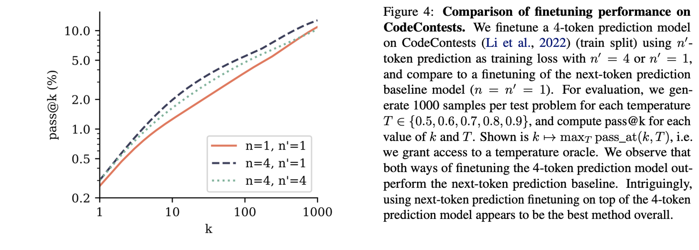

# Better & Faster Large Language Models via Multi-token Prediction
*Posted by Jinoh Cho and Seonghyeon Park*
- Authors: Gloeckle et al. 
- Institution : FAIR at Meta, CERMICS Ecole des Ponts ParisTech and LISN Universite Paris-Saclay
  
# Motivation 
Conventional LLM trained with a next-token prediction loss latches on local patterns and overlooks “hard” decisions. Author wants to alleiviate this issue with pre-training with multi-token prediction loss.

# Preliminaries

### Language Modeling and Next-Token Prediction Task

Learning through a next-token prediction task has been a mainstream for language modeling. The goal of a next-token prediction task is to maximize the probability of the next token $x_{t+1}$, given the history of previous tokens $x_{t:1} = x_1, \ldots, x_t$. This can be formulated as follow:

$$ 
L_1 = - \sum_{t} \log P_{\theta}(x_{t+1} \mid x_{t:1}), 
$$

where $P_{\theta}$ represents large language model under training. 

# Core Idea

### Multi-Token Prediction Task 

In this work, authors propose to learn language modeling from a multi-token prediction rather than a next-token prediction. At each position of the training corpus, the model is instructed to predict $n$ future tokens at once. Thus, the training objective is changed as follow:

$$
L_n = - \sum_{t} \log P_{\theta}(x_{t+n:t+1} \mid x_{t:1}) = - \sum_{t}\sum_{i=1}^{n} \log P_{\theta}(x_{t+i} \mid x_{t:1}). 
$$

### Memory-Efficient Implementation
Directly training language models by minimizing the multi-token prediction loss could result in high GPU memory usage, severly limiting the allowable batch-size. Thus, authors propose to carefully adapt the sequence of forward and backward operations for each prediction head rather than operating forward and backword operations simultaneusly for all heads. This could result in reducing peak GPU memory usage $O(nV+d)$ into $O(V+d)$. Here, the $n$ and $V$ denote the number of head and vocabulary size, respectively. Note that $d$ is the vector dimension of shared transformer trunk. 

    

### Faster Inference with Self-Speculative Decoding
For speed up in inference time, authors utilize self-speculative decoding (Stern et al., 2018) scheme. Specifically, instead of iteratively predicting a next single token for the given token sequence, authors directly generate n-token using n independent output heads in a single step. This significantly speed up the decoding stage.

    

# Result

### Learning global patterns with multi-byte prediction

To show using multi-token prediction loss helps to capture global pattern than using next-token prediction loss, they include experiment using extreme case of byte-level tokenization. Notably, as shown in the table 1, multi-token prediction (8-byte prediction) models significantly solve more problem in the case of trained on small number of data.

    

### Coding Benchmarks

Pre-trained model with multi-token prediction loss maintains an edge on that with next-token prediction loss. At the beginning, they pre-train the 7B parameter models with multi-token prediction loss or next-token prediction loss. (Use the pre-trained model on MBPP, HumanEval and APPS) Then, they finetune the models with CodeContests dataset (Li  et al., 2022) with multi-token head or next-token head. 

    

### Natural Language Benchmarks
- Choice Tasks : Multiple token training with 7B models doesn’t improve performance on choice tasks
- Summarization : Multi-token prediction models with both n = 2 and n = 4 improve over the next-token baseline in ROUGE-L F1 scores for both training dataset sizes, with the performance gap shrinking with larger dataset size.
- Mathematical Reasoning : After 200B tokens, the 2-token prediction model has a clear advantage over the next-token baseline but the order reverses after 500B tokens. The 4-token prediction model is worse throughout.

    

# Why does it work, Athors' Speculations?

### Lookahead reinforces choice points 

Multi-token prediction assigns weights to training tokens based on their correlation with successors. Difficult-to-predict choice points receive higher weights compared to inconsequential transitions. The weighting system allocates n(n+1) points to correlated tokens and n points to inconsequential ones.

    

### Information-Theoretic View

Next token prediction loss involves $H(X) = H(X | Y) + I(X; Y)$, while multi-token prediction loss involves $H(X) + H(Y) = H(X | Y) + 2I(X; Y) + H(Y | X)$. This indicates that multi-token prediction places twice the emphasis on the mutual information term compared to next token prediction. Essentially, 2-token prediction encourages models to precompute features useful for predicting the next token \( Y \), thereby increasing the importance of the mutual information term in the loss calculation.

### Compare with similar works
- Qi et al. (2020) argue that multi-token prediction encourages planning, improves representations and prevents the overfitting on local patterns that can result from teacher-forced training. However, their technical approach replicates the residual stream n-fold while ours allows for compute-matched comparisons and makes the residual representations participate more directly in the auxiliary loss terms.
- Stern et al. (2018) and Cai et al. (2024) propose model finetunings with multi-token prediction for faster inference but do not study the effects of such a loss during pre-training.

# Conclusion
Author propose using multi-token prediction loss instead of next-token prediction loss for pre-training language models. This pre-training scheme has shown improvements across various tasks, notably in code tasks.

# Discussion
- For each task and dataset, the optimal number of heads $n$ varies. I would like to see more correlations between dataset characteristics and the optimal $n$.
- I would like to see more evidence of the global capturing ability of multi-token prediction loss in other experimental settings.
- Authors demonstrates cases including $(n=4, n'=1)$, $(n=4, n'=1)$, and $(n=1, n'=1)$ on the code task, where $n$ and $n'$ denote number of pre-training head and that of finetuning head. However, I would like to see the $(n=1, n'=4)$ setting result on the code task. Conducting this experiment would help determine if the $n=4$ case still outperforms the $(n=1, n'=4)$ setting. If so, the author's argument for pre-training with the multi-task prediction scheme would be further substantiated.
- I would like to study more about multi-token prediction head experiments on multi-token prediction loss with stride=2,4,8,16 ... (This paper shows only with stride=1 setting, predicting consecutive tokens) or extremely large number of multi-token prediction head setting.
  
# Reference
Mitchell Stern, Noam Shazeer, and Jakob Uszkoreit. Block-wise parallel decoding for deep autoregressive models, 2018.

Weizhen Qi, Yu Yan, Yeyun Gong, Dayiheng Liu, Nan Duan, Jiusheng Chen, Ruofei Zhang, and Ming Zhou. Prophetnet: Predicting future n-gram for sequence-to-sequence pre-training, 2020.

Tianle Cai, Yuhong Li, Zhengyang Geng, Hongwu Peng, Jason D. Lee, Deming Chen, and Tri Dao. Medusa: Simple llm inference acceleration framework with multiple decoding heads, 2024.
