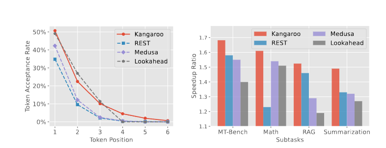
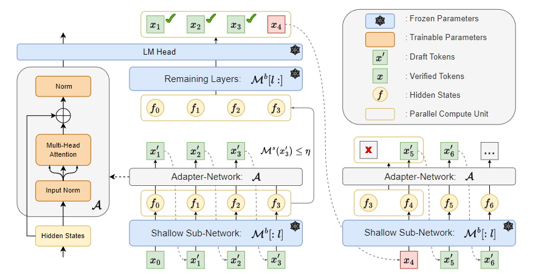
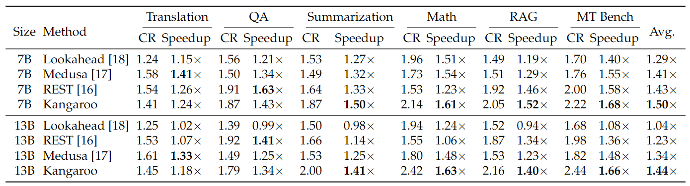
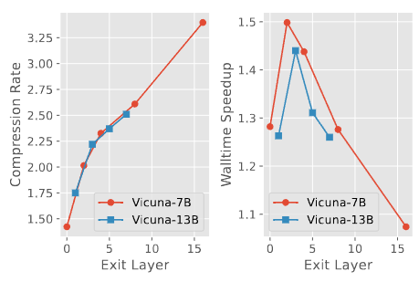
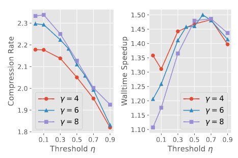
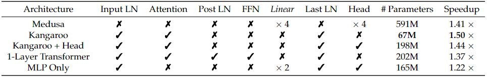

type: docs
bookToc: True
weight: 1
---

# Kangaroo: Lossless Self-Speculative Decoding via Double Early Exiting
* Author: Liu F, Tang Y, Liu Z, Ni Y, Han K, Wang Y

Written by Nayoung Kwon and Jiwoong Im

## Introduction

The growing demand for rapid and efficient inference in large language models (LLMs) faces a significant bottleneck.
* Decoding N tokens requires N sequential runs of the model. 

⇒ LLM inference is slow.

To address this issue, speculative decoding has been introduced as a promising approach to accelerate LLM inference without altering the output quality. This method leverages two key observations about LLM inference: 
* Many tokens can be predicted with minimal computational overhead. 
* LLM inference is predominantly constrained by memory bandwidth rather than arithmetic computations.
*Speculative decoding* reduces the need for frequent memory operations on their parameters by focusing computational efforts on validating pre-drafted tokens, thus enhancing inference efficiency.

However, existing speculative decoding such as **Medusa** [4] and **Lookahead** [3]still face limitations, such as high inference latency and suboptimal token acceptance rates. 
The paper proposes Kangaroo to address this challenge.

## Backgrounds
### Speculative Decoding

Speculative decoding is an approach to accelerate LLM inference. 

**Draft model:** Additional model to accelerate inference (also known as drafter).

**Verifier or target model**: Original LLM.

    

    Fig. 1. Contrast between autoregressive decoding and speculative decoding.

**Left model**: The target LLM generates N tokens in N forward steps, which is a "serial" process.

**Right model**: The drafter generates tokens in parallel. Each generated token is then verified with a verification step.

*Speculative decoding* can be implemented through methods such as independent drafting and self-drafting.

**Independent Drafting**: This approach uses a small language model (LM) from the same series as the target LLM.
- Requires additional training and increases computational complexity by integrating separate target and drafting models.
  
**Self-Speculative Decoding**: This method utilizes the target LLM itself.
- Employs techniques such as Blockwise Decoding, Medusa, and early exiting to reduce computational burden.
- Computational efficiency can also be achieved through layer skipping.

### Kangaroo: Self-speculative decoding
**Kangaroo** refers to the self-speculative decoding method, utilizing a fixed shallow sub-network of the original (target) large LLM.

    

    Fig. 2. Comparison of various self-drafting speculative decoding methods.

In each decoding step, drafted tokens must be verified in parallel to ensure alignment with the target LLM, which determines the token acceptance rate. High token acceptance rates are crucial for the efficiency of this process. However, methods like Medusa have yet to achieve satisfactory token acceptance rates, as evidenced by performance metrics (see left graph). On the other hand, the Lookahead method achieves a high token acceptance rate but has a very low speedup ratio (see right graph).
Addressing these trade-offs, **Kangaroo** offers a solution by training a lightweight and efficient adapter module integrated with a fixed subnetwork of the target LLM, enhancing both the acceptance rate and overall speedup.

## Kangaroo

The author has proposed a novel self-speculative decoding framework, named **Kangaroo**. Kangaroo utilizes double early exiting mechanisms, layer early exiting and draft early exiting.
* *Layer early exiting* suggests the equivalent self-draft small model exiting early from the fixed shallow layers of the large LLM and connecting to an adapter network to generate draft tokens. While this strategy is commonly used for self-speculative decoding frameworks, Kangaroo has further investigated suitable architectures of the adapter module and offered a low-cost approach to train a lightweight model.
* *Draft early exiting* uses early exiting at suitable points during the drafting phase to avoid unnecessary computational overhead on more challenging tokens.

    

    Fig. 3. The framework of Kangaroo.

Fig. 3 illustrates the framework of Kangaroo.
1. The lightweight drafting model  \mathcal{M}^s , including shallow sub-network and adapter network, predicts the draft tokens autoregressively until draft early exiting occurs.
2. \mathcal{M}^s stops drafting once the confidence level of the current draft token falls below a certain threshold, e.g., \mathcal{M}^s(x_3') \leq \eta.
3. The hidden states, computed in shallow sub-network, are processed in the remaining layers of LLM to generate prediction results.
4. The draft tokens and the original prediction results are compared for verification, and once a draft token is rejected, the subsequent tokens are discarded.
5. The token x_4 that has resulted in an uncertain drafting is also predicted at the verification step. If all draft tokens are accepted, the next decoding step starts with the prediction result of the last token x_4. (It is not necessary to predict x'_4 once more.)

### Evaluation Metrics

Speculative decoding is often evaluated using two primary metrics: walltime speedup ratio and compression rate. Given a speculative decoding algorithm, we assume that N tokens should be generated via the drafting model. As the drafting model predicts multiple tokens in each decoding step and multiple tokens can be accepted by the large model in a step, we record the number of accepted tokens per step as a list  S = [s_1, s_2, \dots, s_{|S|}] , where  \sum_k s_k = N  and  |S|  denotes the number of steps. Then, the compression rate (CR) is defined as:

\text{CR} = \frac{1}{|S|} \sum_k s_k.

However, once a draft token is rejected during the verification, all subsequent tokens sampled from the drafting model will be discarded. Therefore, CR does not accurately reflect the acceptance levels for tokens at varying distances, and the author has proposed a new evaluation metric named *consistent token acceptance rate*.

The consistent token acceptance rate  \text{CTAR}(w)  is calculated as:

\text{CTAR}(w) = \frac{1}{|S|} \sum_k \mathbb{I} (s_k - w > 0),

where \mathbb{I}(\cdot) denotes an indicator function and  w  denotes a window size. CTAR can be interpreted as a rate of the number of steps to accept over  w  tokens. Fig. 2 represents the empirical CTARs for w = 1,2,\dots,6  of self-drafting speculative decoding frameworks including Kangaroo on the mathematical reasoning subtask of Spec-Bench [1].

### Adapter Network as Self-Draft Model

We assume the target LLM has  L  layers and the self-draft model  \mathcal{M}^s  consists of shallow sub-network  \mathcal{M}^b[:l] , which is first  l  layers of the target LLM \mathcal{M}^b, and a adapter network  \mathcal{A} . The drafting model reuses the LM head of the target LLM, and the overall parameters of the target LLM, such as shallow sub-network, remaining layers of LLM, and LM head, are frozen during the training of the adapter network. In Kangaroo, the adapter  \mathcal{A}  only encompasses one multi-head attention and two normalization layers. The author emphasizes the feed-forward network (FFN) of the transformer block is too heavy in parameters but redundant, which is presented in the ablation study of the adapter architecture in the Experiments Section.

The training loss of the self-draft model is formulated by the cross-entropy loss:

\mathcal{A}^* = \text{arg}\min_\mathcal{A} \sum_t \sum_n -\mathcal{M}_n^b (x_t) \log \mathcal{M}_n^s (x_t).


### Draft Early Exiting

While speculative decoding typically drafts a fixed number of tokens per step, it leads to several problems of local optima, waste on challenging samples, and prolonged inference latency of the draft model.
Therefore, the author proposes draft early exiting, which stops drafting once the top-1 confidence on the self-draft model is below a predefined threshold \eta, i.e.,

\max_n \mathcal{M}_n^s (x) \leq \eta.


## Experiments

The author has conducted experiments on Vicuna [2] models with sizes of 7B and 13B and compared Kangaroo with other self-speculative decoding approaches, Lookahead [3], Medusa [4], and REST [5], in Fig. 2 and Table 1.

    

    Table 1. Comparison of self-speculative decoding frameworks in terms of compression ratio (CR) and walltime speedup ratio (Speedup).

### Ablation Studies

    

    Fig. 4. Ablation study for appropriate exit layer.

Fig. 4 demonstrates the trade-off between the compression rate and the walltime speedup varying by the early exit layer l. Later exit layer leads to larger sub-network \mathcal{M}^b[:l] and smaller remaining layers \mathcal{M}^b[l:], so an adapter network easily imitates remaining LLM layers but the self-draft model \mathcal{M}^s becomes heavy. The paper set l=2 for Vicuna-7B and l=3 for Vicuna-13B.

    

    Fig. 5. Ablation study for appropriate threshold.

Fig. 5 demonstrates the effect of draft early exiting comparing the optimal threshold \eta. \eta=0 points represent a typical self-speculative scheme with a fixed step strategy, which achieves the maximum compression rate but leads to sub-optimal end-to-end walltime speedup.

    

    Table 2. The architecture of the adapter module for Vicuna-7B.

Table 2 demonstrates an ablation study on the architecture of the adapter module. In Table 2, removing the FFN and sharing the LM head of LLM (Kangaroo + Head) is most effective.

## Discussion and Conclusion

Kangaroo with a double early-exit mechanism ensures both efficiency and high performance.

Several advantages:

- **Low-Cost Training**: The shared KV cache and computation between the self-speculative draft model and the large LLM
                         → only the adapter network requires additional deployment.
- **Efficiency**: Experiments on Spec-Bench demonstrate that Kangaroo achieves up to 1.7× speedup, outperforming existing methods with significantly fewer additional parameters (67M compared to 591M for Medusa).
- **Flexibility**: By focusing on reducing inference latency and optimizing token acceptance rates, Kangaroo ensures that performance remains robust across various tasks without incurring substantial overhead.

Compare with others:

Kangaroo's performance surpasses other speculative decoding methods, such as Medusa and Lookahead, particularly in terms of end-to-end speedup and token acceptance rates (see Fig. 2 in the introduction). The double early-exit mechanism plays a crucial role in maintaining this balance by efficiently handling easier tokens and exiting early when confidence is lower than the predefined threshold, thus minimizing latency.

### Limitations and future work:

- **Enhanced Confidence Metrics**: 
    - Although Kangaroo introduces a confidence-based mechanism, it retains the original issue of discarding generated tokens that do not meet the confidence threshold. 
    - Currently, confidence is measured only on the top-1 prediction. Future work could explore alternative metrics such as entropy or other measures to provide a more robust assessment of token validity.
- **Alternative Networks for Adapting**: 
    - The use of an adapter network in Kangaroo shows promising results. However, experimenting with different network architectures could yield even better performance. Future research could investigate various types of networks to replace the adapter, potentially improving both the efficiency and accuracy of the speculative decoding process.
- **Adaptive Early-Exit Mechanisms**: 
    - The current implementation of early exits in Kangaroo could be refined by dynamically adjusting the confidence thresholds based on the context or specific tasks. This adaptation could further reduce unnecessary computations and improve the overall efficiency of the model.

 
## References

[1] Heming Xia, Zhe Yang, Qingxiu Dong, Peiyi Wang, Yongqi Li, Tao Ge, Tianyu Liu, Wenjie Li, and Zhifang Sui. Unlocking efficiency in large language model inference: A comprehensive survey of speculative decoding. _arXiv preprint arXiv:2401.07851_, 2024.

[2] Wei-Lin Chiang, Zhuohan Li, Zi Lin, Ying Sheng, Zhanghao Wu, Hao Zhang, Lianmin Zheng, Siyuan Zhuang, Yonghao Zhuang, Joseph E Gonzalez, et al. Vicuna: An open-source chatbot impressing gpt-4 with 90%* chatgpt quality. *See https://vicuna.lmsys.org (accessed 14 April 2023)*, 2(3):6, 2023.

[3] Yichao Fu, Peter Bailis, Ion Stoica, and Hao Zhang. Break the sequential dependency of llm inference using lookahead decoding. *arXiv preprint arXiv:2402.02057*, 2024.

[4] Tianle Cai, Yuhong Li, Zhengyang Geng, Hongwu Peng, Jason D Lee, Deming Chen, and Tri Dao. Medusa: Simple LLM inference acceleration framework with multiple decoding heads. *arXiv preprint arXiv:2401.10774*, 2024.

[5] Zhenyu He, Zexuan Zhong, Tianle Cai, Jason D Lee, and Di He. Rest: Retrieval-based speculative decoding. *arXiv preprint arXiv:2311.08252*, 2023.
