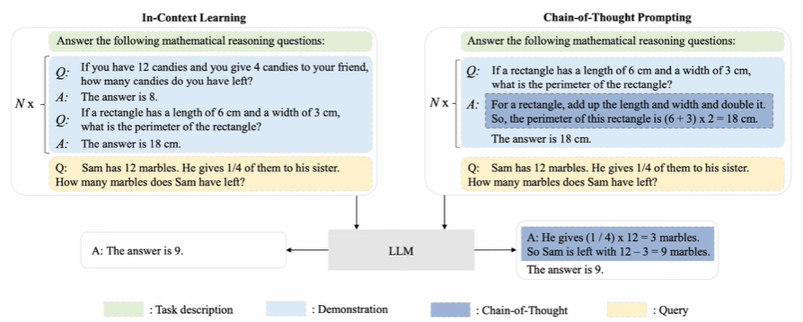
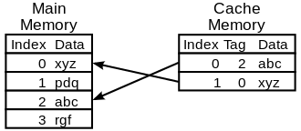
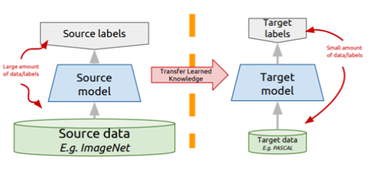
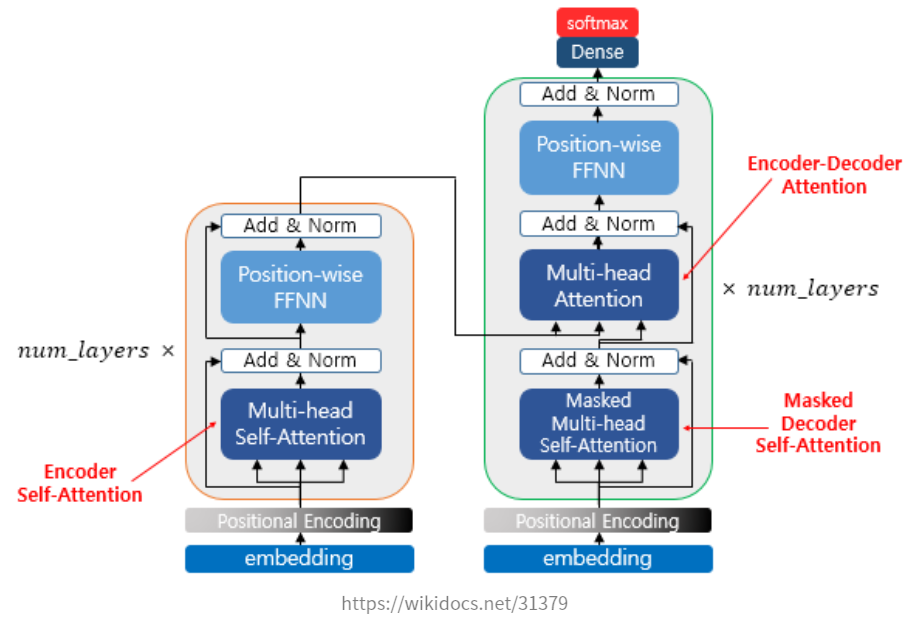
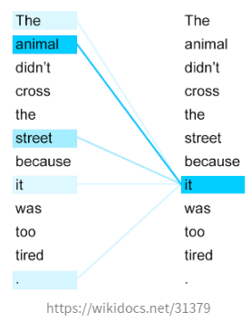
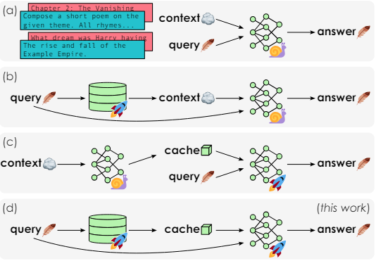

# XC-CACHE: Cross-Attending to Cached Context for Efficient LLM Inference

*Submitted on 23 Apr 2024 by* João Monteiro1, Étienne Marcotte1,*, Pierre-André Noël1,*, Valentina Zantedeschi1,*, David Vázquez1, Nicolas Chapados1, 2, Christopher Pal1, 2, Perouz Taslakian11, ServiceNow Research.

    

In ICL, a single prompt is composed of a task description, demonstration, and query. When this prompt is passed through a Large Language Model (LLM), it results in obtaining the desired response. The model understands how to perform a specific task within a given context through examples. This process involves setting the context, providing examples, and then generating appropriate outputs based on the combined information. ICL allows the model to perform specific tasks efficiently without requiring additional training or fine-tuning. typically uses prompting to condition the generation of decoder-only language models based on reference information. 

However, just-in-time processing of context is inefficient due to the quadratic cost of self-attention operations, making caching desirable. Yet, caching transformer states can demand nearly as much space as the model parameters themselves, posing a challenge when the appropriate context is not known in advance.

### LLM
LLM(Large language model) is a technology that understands and creates language-like text from vast amounts of data
For example, Translation, Fixing typos, question-answer, summary, ...

**- Emergent abilities of LLM**
“the ability that are not present in small but arise in large models”
- J.Wei et al,, “Emergent abilities of large language models,”
⇒ **Large Language Models that can be performed on unlearned tasks**

“Emergence is when quantitative changes in a system result in qualitative changes in behavior.”
- “More is Different” by Nobel prize-winning physicist Phulip Anderson

NLP vs LLM
NLP (Natural Language Processing)
- Covers general language analysis
LLM (Large-Language Model)
- Subset of NLP
- Based on "Large" dataset

### Caching

    
     
    <i>Fig. 2 The way of Caching</i>

Caching involves storing data or computation results in a temporary storage area called a cache. When a request is made, the system first checks the cache. If the data is found (cache hit), it is retrieved from the cache; otherwise (cache miss), it is fetched from the source, processed, and stored in the cache.

Advantages of caching include faster access to frequently used data, efficient resource use by reducing redundant computations, and improved service availability during network issues. However, challenges include maintaining data consistency and the need for additional memory.

Common uses of caching are web page caching for faster loading, database query caching to reduce load and response times, and API caching to decrease the number of API calls and improve performance. Caching is vital for enhancing performance in large-scale and data-intensive applications.

### Transformer

    
     
    <i>Fig. 3 Procedure of learning in Transfrer model</i>

In Transformer models, the Attention Mechanism helps the model focus on important parts of the input data. It uses three main components: Key, Value, and Query, which are vectors derived from input tokens. Keys capture token features, Values contain the token content, and Queries represent the current token's features. The attention process calculates match scores between Queries and Keys, normalizes these scores with softmax, and computes a weighted sum of Values based on these probabilities. This allows the model to understand complex relationships within the data, enabling accurate and contextually appropriate responses.

### Self-Attention
Finding the relationship between a sentence and a sentence.
In other words, looking at the relationship between words and words within a sentence.

- Attention

The basic idea of attention is to once again refer to the entire input sentence in the encoder at each time step at which the decoder predicts the output word. However, rather than considering all input words in the same proportion, we will focus more on the input word part related to the word to be predicted at that point.

The attention function is usually expressed as follows

Attention(Q, K, V) = Attention Value

The attention function individually calculates the similarity with all keys for a given query and reflects these similarities in each value associated with that key. Then, all of the 'Values' reflecting this similarity are summed and returned.

These results are called Attention Value.
Q: Concealed states in decoder cells at all time points
K: Silver states of encoder cells at all time points
V: Concealed states of encoder cells at all time points

Self-attention means that Q, K, and V are all the same. In the transformer, three attention types are used: Encoder Self-attention, Masked Decoder Self-attention, and Encoder-Decoder Attention. Naturally, both self-attention have the same Q, K, and V of themselves, but in the third Encoder-Decoder Attention, Query is the vector of the decoder and Key and Value are the vectors of the encoder.

    

To intuitively understand the self-attention of the encoder, it means that the similarity between words in the input sentence is obtained.

    

 This paper addresses these challenges by introducing models that use **cross-attention**, inspired by the encoder-decoder architecture, to condition generation on reference text without a prompt. The approach leverages pre-trained decoder-only models and trains only a small number of added layers. The authors use Question-Answering (QA) as a testbed to evaluate these models' ability to perform conditional generation. 

    

    Fig. 1. Contrast between autoregressive decoding and speculative decoding.

 These four approaches highlight various strategies for efficient context processing in large language models. 

(a) depicts a scenario where a user’s query must be interpreted within a given context to generate an answer. In this case, the query and answer are small (light), but the context is large (heavy). This results in a time complexity of O(|context|²) for the [LLM](https://www.notion.so/LLM-e5c86372d9404c97ba24cb1491243a84?pvs=21).

(b) explains [***In-Context Learning (ICL)***](https://arxiv.org/abs/2005.14165) and [***Retrieval-Augmented Generation (RAG)](https://arxiv.org/abs/2005.11401)***  which use the query to look up the context from a finite corpus, but still remain inefficient with large contexts.

(c) can be preprocessed into a cache, enabling fast inference on a given query. This [***approach***](https://arxiv.org/abs/1706.03762) has a time complexity of O(|context|(|query| + |answer|)).

(d) is the method that the author proposed named **XC-CACHE**. It is implemented in two ways that leverage pre-trained decoder-only models and add a separate encoder to process the context: one approach uses the frozen decoder as an encoder (called XC-LLAMA), and the other uses a small bidirectional encoder (called XC-LLAMAENC).

## **Caching Representations and XC-CACHING**

[**Cache**](https://en.wikipedia.org/wiki/Cache_(computing)) is typically a form of memory that allows for fast access, storing data that is frequently used or needed repeatedly. [***The main purpose*](https://www.notion.so/7708a6d8eeaf4a7082e9da6b4b90950d?pvs=21)** of a cache is to improve processing speed and enhance the overall efficiency of the system. There are [***three types of elements***](https://www.notion.so/e10d87b5902d4dfb94edbbecc2582efe?pvs=21) called ‘key’, ‘value’, ‘query’ which can approaches to Caching. 

 KV(Key-Value) Caching ******is to store the (past) key and value states generated while processing context.  As an example, for [***LLAMA 2-7B***](https://arxiv.org/abs/2307.09288) using 16 bits precision shows that the smaller per-token cache teh sizes are more desirable. JIT(Just-In-Time Key-Value Caching)-KV Caching is an alternative approach involves storing the (past) hidden states of the model in the cache. At inference time, once these hidden states are loaded on GPU, we can recover the full keys and values in O(|context|). These two KV and JIT-KV Caching model both entail two types of costs while yielding identical results: the size of the cache and the operations required during inference. So **XC-Caching** is presented as an effective way to improve inference speed while significantly reducing memory usage.

(a) The architecture uses a small bidirectional encoder and multiple self-attention and cross-attention layers to process the context and prompt.
(b) The architecture uses only a decoder, mainly training the cross-attention layers to process the context and prompt.

## Low memory usage, High precision XC-CACHING

 QA is ideal for testing the methods as it requires efficient external information retrieval and incorporation during generation. They focus on training for question-answering using datasets with context, query, and answer triplets. They build a training dataset by standardizing and combining the training partitions of five publicly available and diverse datasets: [***NATURAL QUESTIONS](https://aclanthology.org/Q19-1026/)*** (NQ), [***HOTPOTQA***](https://arxiv.org/abs/1809.09600), [***TOPIOCQA***](https://aclanthology.org/2022.tacl-1.27/), [***MS MARCO***](https://arxiv.org/abs/1611.09268), and [***SQUAD-V2***](https://aclanthology.org/P18-2124/). Each example in the resulting dataset contains a query (natural-language question), an answer (expected output), and one or more contexts (e.g., knowledge base articles), with at least one context containing the answer, referred to as the reference context. 

 In addition to training on the primary QA tasks, they optimize their models on context repetition tasks, named [multitask](https://www.v7labs.com/blog/multi-task-learning-guide) training strategy.
