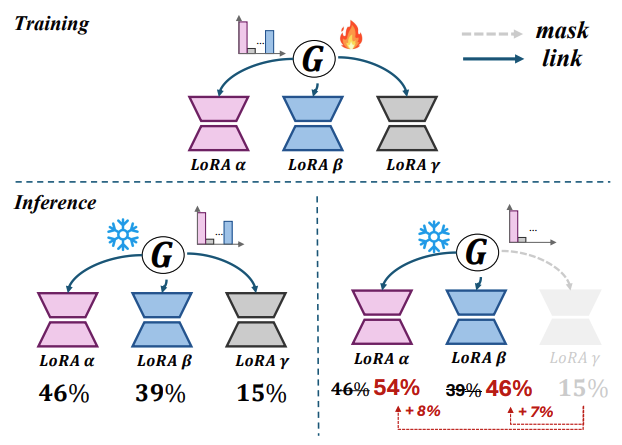

# MIXTURE OF LORA EXPERTS

LoRA is a methodology for effective fine-tuning large-scale pretrained models. LoRA is characterized by its ease of applying tuned results to existing models. This property encouragees research into synthesizing multiple trained LoRAs to achieve enhanced performance across various tasks such as linear arithmetic composition and reference tuning-based composition. However, combining these trained LoRAs poses significant two challenges:

1. **Linear arithmetic composition can diminish the capabilities of the original pre-trained models and the unique characteristics of the individually trained LoRAs, potentially leading to suboptimal results.**

2. **Reference tuning-based composition is limited in adaptability and incurs substantial computational costs, as it necessitates retraining a large model.**

So, we can ask following question:

_How can multiple trained LoRAs be composed dynamically and efficiently, preserving all their individual characteristics, without the need for retraining?_

To address this question, Mixture of LoRA Experts (MoLE) presents a new method for achieving the optimal combination of LoRAs for specific tasks. MoLE considers indivisual LoRA as an expert and determines the weights applied to LoRAs at each layer through a gate function.

    
     
    <em>Workflow of Mixture of LoRA Experts (MoLE)</em>

## Background

### What is LoRA?

_Low-Rank Adaptation (LoRA) is a parameter-efficient and effective approach for fine-tuning large-scale pretrained models._

Models such as OPT, LLaMA, and CLIP demonstrate remarkable performance when fine-tuned for various downstream tasks. However, full fine-tuning of these massive models requires substantial computational resources. LoRA enables parameter-efficient fine-tuning by keeping the pretrained model's weights frozen and adding trainable low-rank decomposition matrices.

    
     
    <em>LoRA Methodology</em>

In the above figure, only the matrices A and B are trained, with dimensions (d x r) and (r x d) respectively. By setting r << d, the number of parameters to be trained can be reduced. These trained matrices are then simply added to the existing pretrained weights, allowing tuning without affecting the inference speed of the original model.

### LoRAs Composistion

The common solution to further improve the performance of LoRA across various tasks is to compose multiple trained LoRAs. Research on LoRA composition can be broadly categorized into the following two methodologies.

* _**Linear arithmetic composition.**_ It is a method of directly adding multiple LoRAs. This approach is simple and has been effective in the NLP and Vision-Language domain, but it can result in the loss of pre-trained model's generative capabilities or the individual characteristics of each LoRA.


\hat{\mathbf{W}} = \mathbf{W} + \sum_{i=1}^{N} w_i \cdot \Delta \mathbf{W}_i


* _**Reference tuning-based composition**_ tackles the above limitations of linear arithmetic method by introducing gradient fusion and controllable sampling, but is requires retaining when incorporating different LoRAs or creating new masks, which results non-trivial computational costs.

     
     
    <em>(Left) Linear arithmetic composition. (Right) Reference tuning-based composition</em>

### Mixture-of-Experts

MoE is an effective method that allows scaling up the number of parameters while maintaining the computational cost of the model.

     
     
    <em>Illustration of a Swith Transformer block.</em>

* Experts FFN Layers: MoE layer is composed of N separate feed-forward networks as the experts. This concept involves dividing the FFN layer of traditional transformers into N experts. These experts can be thought of as being responsible for specific tokens.

* Gating functions (Router): A function that determines the weights over the experts outputs. For the hidden representation h of input token, and the trainable embedding e of each a expert, the gate value a is obtained as follow:


\alpha(E_i) = \frac{\exp(h \cdot e_i)}{\sum_{j=0}^{N} \exp(h \cdot e_j)}


The output is a weighted sum of the outputs from the top-k experts, determined by the gated values.


O = h + \sum_{i=0}^{N} \alpha(E_i) \cdot E_i(h)


## Mixture of LoRA experts

### Observations
1. Direct linear arithmetic composition reduced the generative power of the model, while normalized linear arithmetic composition retained the generative power of the model but lost its LORA character.

    
    
     
    <em>(Left) Result of linear arithmetic composision. (Right) Result of nomalized linear arithmetic composision.</em>

    
     
    <em>Experiment in the NLP domain. NLA denotes normalized linear arithmetic composision </em>

In the V&L domain, directly composing multiple trained LoRAs into the original embedding caused significant parameter variations and meaningless output, while normalization compromised their original characteristics.  In the NLP domain, composing four or more LoRAs within the FLAN-T5 model resulted in disordered output, and weight normalization across five datasets decreased the performance, suggesting adverse effects on the intrinsic qualities of the trained LoRAs.

2. Each layer of the trained LoRA represented a unique characteristic, which cumulatively defined the overall properties of the LoRA.

    
    
    <figcaption align="center">
     
    <em>(Right) Observed that different layers of LoRA encode distinct features, such as dog coat color and facial features. (Left) When evaluated on a subset of datasets, there were significant differences in performance across the different layers of LoRA.) </em>

        
**So, The conjecture is that adjusting the characteristics by varying the layer-specific weights according to the desired domain objective will result in a more effective composition of trained LORAs.**

### Method

    
     
    <em>Illustration of proposed MOLE. MOLE employs a learnable gating function that utilizes the outputs of multiple LoRAs at each layer to determine composition weights.</em>

    
See related formulas

        <b>Symbols</b>  
        input $x \in \mathbb{R} ^ {L \times d}$  
        L: sequence length  
        d: dim of $x$  
        Multi attention layer : $$\mathcal{f}_{Attn} (\centerdot)$$  
        Feed forward neural network layer: $$\mathcal{f}_{FFN} (\centerdot)$$    
        LN: layer normalization  
        Trained LORAs $$\Omega = \left\{ \Delta \Theta \right\}^N_{i=0}$$  
        learnable gating function $$\mathcal{G} (\centerdot)$$  
        The weight of the $i^{th}$ trained LorA $$\mathcal{G}_i (\centerdot)$$  
        Concatenation operation: $$\oplus$$  
        Learnable parameter $e \in \mathbb{R} ^ {N^2 \times L \times d}$  
        Learnable temperature scalar $\tau$  
         
        <b>Freezing part</b>
        $$x^\prime_{\theta} = x + \mathcal{f}_{Attn} (LN(x)|\theta)$$  
        $$\mathbf{F}_\theta (x) = x^\prime_{\theta} + \mathcal{f}_{Attn} (LN(x^\prime_{\theta})|\theta)$$  
         
        <b>LoRA part</b>
        $$x^\prime_{\Delta \Theta_i} = x + \mathcal{f}_{Attn} (LN(x)|\Delta \Theta_i)$$  
        The output of each LoRA $$\mathbf{E} _{\Delta \Theta_i} (x) = x^\prime_{\Delta \Theta_i} + \mathcal{f}_{FFN} (LN(x^\prime_{\Delta \Theta_i})|\Delta \Theta_i)$$  
        The output of all LoRA $$\mathbf{E}_\Omega (x) = Normalization(\mathbf{E}_{\Delta \Theta_0} (x) \oplus \ldots \oplus \mathbf{E}_{\Delta \Theta_{N-1}} (x)) \in \mathbb{R} ^ {N \times L \times d}$$  
        Flatten and dot product operation $$\epsilon = Flatten(\mathbf{E}_\Omega (x))^T \centerdot e,  \epsilon \in \mathbb{R} ^ N$$  
        Gate value for each LoRA $$\mathcal{G} (\epsilon_i) = \frac {exp(^{\epsilon_i} /_ \tau)} {\displaystyle\sum_{j=1}^N {exp(^{\epsilon_j} /_ \tau)}} $$  
        Final output of the gating function $${\tilde{\mathbf{E}}_\Omega (x)} = \displaystyle\sum_{i=0}^N {\mathcal{G} (\epsilon_i) \centerdot \mathbf{E} _{\Delta \Theta_i} (x)} , {\tilde{\mathbf{E}}_\Omega (x)} \in \mathbb{R} ^ {L \times d} $$  
        <b>Final output of Transformer block</b>
        $$\mathcal{O}(x) = {\mathbf{F}_\theta (x)} + {\tilde{\mathbf{E}}_\Omega(x)} $$ 

 

### Training
The training loss function used in MoLE is as follows:

    


$$\mathcal{L} = \mathcal{L}_{D} + \alpha \mathcal{L}_{balance}$$


Alpha is a coefficient for weight balancing. 

**Gating Balacing Loss**

    

As shown in Figure 5 (a), the average entropy of the distribution probabilities from the gating functions gradually decreases as training progresses. In Figure 5 (b), we can see a gating probability of 64% for LoRA β among the three LoRAs, indicating that the gating function tends to converge to a state where it assigns large weights to well-performing LoRAs in the early stages. This can result in a significantly larger impact from a few specific LoRAs compared to others, potentially leading to biased outcomes.  
 
To avoid this, the author created a gating balancing loss. 
The gating balancing loss helps prevent bias by ensuring that the loss value decreases as the model becomes less biased.  
 

    

    
See related Symbols

    M: The num of blocks where gating functions are placed  
    N: num of LoRAs

     
 

**Domain-specific Loss**
 
In V&L, Using a loss in CLIP(Radford et al,20221b)  

    

In NLP, Using a loss in FLAN-T5(Chung et al,2022)

    

## Results

**On V&L Domain**
 
- Setup)
   
  Base generator: DeamBooth(Ruiz et al., 2023) (built on Stable Diffusion V2.1)
   
  LoRA: combination of three separately trained LoRAs
   
  Image resolution: 512x512
   
  learning rate: 1e-5
   
  DDPM sampler (Ho et al., 2020) with 50 steps in each case
   
  Train 400 iterations for each required composition with batch size 2 and α as 0.5
   
- Metrics)
   
  Image alignment: Evaluate the visual similarity of generated images with individual composed concepts in the CLIP image feature space.
   
  Text alignment: Evaluate the text-image similarity of generated images with given text prompts in the CLIP feature space.
   
  For each composition, calculated the average scores among 200 generated images per prompt using 5 text prompts.
   
- Compared Baselines)
   
  - Normalized linear arithmetic composition
  - SVDiff (Han et al., 2023)
- Results)
   

    

        It demonstrates better performance compared to other models and shows outstanding results in other tasks as well.

    
    
    
    <figcaption align="center">

  When viewing the generated images, it is evident that all specified subjects are accurately represented and maintained.
   
    
        
**On NLP Domain**
 
- Setup)
   
  Base Model: Flan-T5 (Chung et al., 2022)
   
  LoRA: Several LoRAs based on FLAN datasets
   
  learning rate: 1e-5
   
  Train 800 iterations for each required composition with batch size 12 and α as 0.5.
   
- Compared Baselines)
   
  -  LoRAhub
  -  PEMs
- Results)

    
    
    <figcaption align="center">

  It can be observed that MoLE demonstrates better performance in most tasks.
  
## Analyisis 

### 1. Gating balancing loss works!
Gating balancing loss function mitigates the reduction in entropy rates within gating functions, and enhance the performance.

     
     
    <em>Experimental results on gating balance of MOLE. NLA denotes normalized linear arithmetic composition</em>

### 2. MoLE is even better than SOTA multi-concept generation methods.
MoLE outperforms two multi-concept generation algorithms (Custom, Textual Inversion), both of which emphasize full-parameter training for enhanced results.

     
     
    <em>Text-alignment and image-alignment results for multiple LoRA experts composition in CLIP feature space. SOTA full-parameter training methods are highlighted by pink boxes</em>

### 3. Scale to a larger number of LoRAs.
MOLE demonstrated optimal performance across varying numbers of LoRA, notably surpassing LoRAHub with larger LoRA counts of 48 and 128. However, all methods, including MOLE, showed performance declines with an extremely large number of LoRA 

     
     
    <em>NLP domain experimental results on the impact of exploring expand expert numbers on model performance. The result is the average EM on the Big-Bench Hard (BBH) dataset.</em>

### 4. Coarse gating vs. fine gating
Among  matrix-wise, layer-wise, block-wise, and network-wise MoLEs, intermediate granularities, b-MoLE and l-MoLE, achieved the highest performance.

     
     
    <em>Coarse-to-fine gating comparison</em>

### 5. Flexibility of MoLE.
MoLE not only achieves effective LoRA composition but also retains the characteristics of individual LoRA. It can generate images that closely resemble the original features of the LoRA experts

     
     
    <em>(Left) Linear arithmetic composition. (Right) Reference tuning-based composition</em>

### 6. Hierarchical control analysis
MOLE adaptively assigns weights to different LoRA experts across various layers, resulting in finer-grained weight combinations that yield superior results.

    <em>Visualization of the weights (%) predicted by each gating function (horizontal axis) for LoRA experts (vertical axis) during inference. The top row corresponds to experiments in the NLP domain, while the bottom row pertains to experiments in the V&L domain.</em>

   
## Discussion and Limitations
**Limitations**
1. LoRA scale  

When the number of LoRAs increases to a very large value (e.g., 128), the performance of all LoRA composition methods, including MOLE, tends to decrease despite MOLE's superior performance. This indicates that MOLE still faces challenges with large-scale LoRA composition and emphasizes the need for better approaches to handle it effectively. 

2. Parameter  

The learnable parameter 𝑒 used in MoLE has dimensions of $N^2 \times L \times D$. As the number of LoRAs increases, the number of parameters grows quadratically, resulting in a substantial increase. Additionally, since e exists for each transformer block, the number of parameters added by 𝑒 is considerable. This can be seen as a drawback of MoLE.
 

**Discussion**

<How to address MoLE's limitations at LoRA scale>  
Currently, MoLE's performance decreases when the number of LoRAs exceeds a certain threshold. By reducing the number of LoRAs to below this threshold with minimal loss, performance could be improved. Assuming there is a large number of LoRAs, there will likely be many LoRAs for similar tasks. Given this, we believe that clustering to derive representative LoRAs for similar tasks and using only the representative LoRAs instead of all similar task LoRAs could overcome MoLE's limitations.

