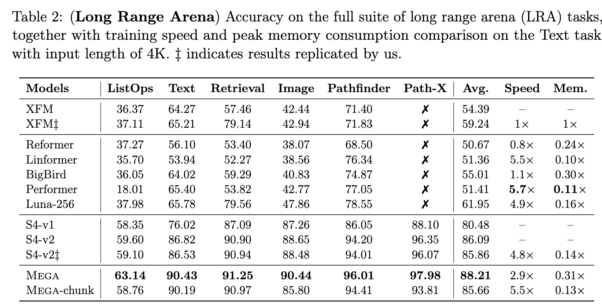
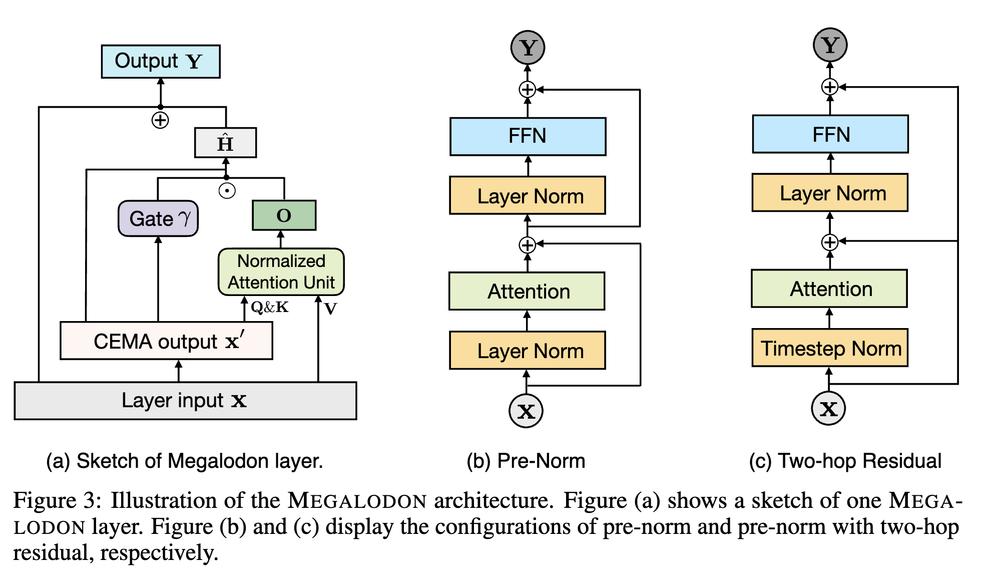
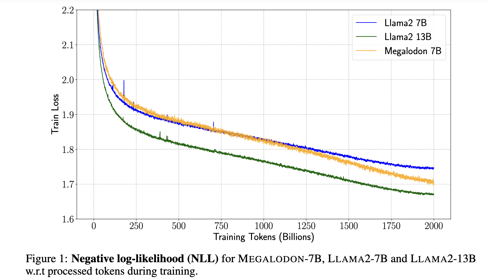
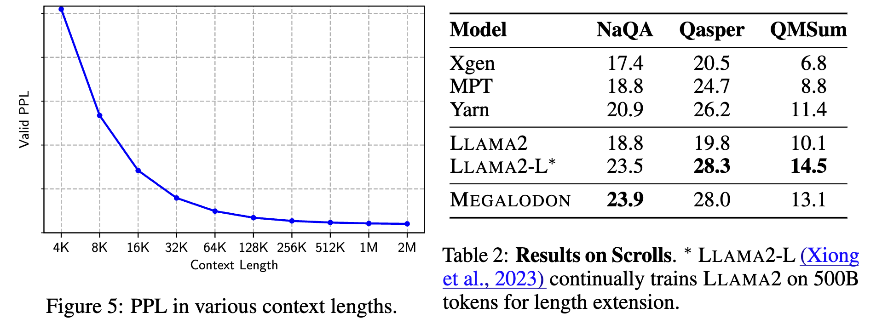

# Megalodon: Efficient LLM Pretraining and Inference with Unlimited Context Length
Authors: Xuezhe Ma, Xiaomeng Yang, Wenhan Xiong, Beidi Chen, Lili Yu, Hao Zhang, Jonathan May, Luke Zettlemoyer, Omer Levy, Chunting Zhou

Reviewer: Hyunho Kook

## 1. Introduction
Recently, Large Language Models (LLMs) have been gaining popularity. The impressive performance and versatility demonstrated by large models above a certain level have started to be utilized in various fields. However, as the size of the models grows, the size of the data that the models are expected to process is also increasing. Examples of this include processing currently open issues by inputting a GitHub repository or translating a large volume of books without losing context. In addition, the ability to maintain context and carry on a conversation for an extended period within a single chat is also sometimes required. The transformer, which is the foundation model of modern LLMs, exhibits vulnerabilities in this regard. Firstly, since it uses KV cache, memory usage increases rapidly as the sequence length grows, and it has a computational complexity proportional to the square of the sequence length.

To address this problem, the authors propose a method that inherits and advances MEGA (exponential moving average with gated attention), the predecessor of this paper. The overall contributions are as follows:

1. **CEMA (Extending Multi-dimensional Damped EMA to Complex Domain)**, an extension of Exponential Moving Average (EMA) to the complex domain, is proposed.
2. **Timestep Normalization, an extension of Group Norm to the timestep domain**, is proposed as an alternative to Layer Norm.
3. **Normalized Attention**, which performs normalization during attention computation, is proposed.
4. **2-hop Residual Connection**, which composes residual connections in 2-hop units, is proposed.

By employing these methods, the authors have created a transformer architecture that is linear with respect to context length. They have also addressed the issues encountered in the previous research, MEGA, which were (i) low performance and (ii) the need for different architecture structures for each data type or task.

## 2. MEGA (exponential Moving avErage with Gated Attention)

Before diving into the main contributions of our work, it's essential to grasp the concepts behind MEGA (Moving Average with Gating Attention), a technique that serves as a stepping stone towards more efficient transformer models. MEGA leverages the moving average with damping to enhance the attention mechanism. Let's break it down step by step.

### 2.a Moving Average with Damping

At the core of MEGA lies the moving average with damping, which can be expressed by the following equations:


\begin{align*}
u_t^{(j)} &= \beta_j x_{t,j} \\
h_t^{(j)} &= \alpha_j \odot u_t^{(j)} + (1 - \alpha_j \odot \delta_j) \odot h_{t-1}^{(j)} \\
y_{t,j} &= \eta_j^T h_t^{(j)}
\end{align*}


This exponential moving average (EMA) serves as the foundation for the subsequent attention mechanism.

### 2.b Generating Query and Key

The EMA is then fed into the attention mechanism to generate the Query and Key matrices after applying the SiLU activation function. First, we calculate the shared representation Z using the EMA of the input X:


\begin{align*}
X' &= EMA(X) \in \mathbb{R}^{n \times d} \\
Z &= \phi_{silu}(X'W_z + b_z) \in \mathbb{R}^{n \times z}
\end{align*}


Using the shared representation Z, we can now compute the queries and keys. It's important to note that the original input X is used to calculate the values:


\begin{align*}
Q &= \kappa_q \odot Z + \mu_q \in \mathbb{R}^{n \times z}\\
K &= \kappa_k \odot Z + \mu_k \in \mathbb{R}^{n \times z}\\
V &= \phi_{silu}(XW_v + b_v) \in \mathbb{R}^{n \times v}
\end{align*}


### 2.c Attention Output Calculation

After obtaining the Query, Key, and Value matrices, we can calculate the output of the attention mechanism using the standard formula:


O = f\left(\frac{QK^T}{\tau(X)}\right)V \in \mathbb{R}^{n \times v}


Here, f is typically the softmax function, and \tau is a temperature function based on the input X.

### 2.d Gating Mechanisms

MEGA employs gating mechanisms, similar to the Gated Linear Unit (GLU), to generate the final output Y and the internal activation \hat{H}. This is achieved through the following equations:


\begin{align*}
\gamma &= \phi_{silu}(X'W_\gamma + b_\gamma) \in \mathbb{R}^{n \times v} \\
\varphi &= \phi_{sigmoid}(X'W_\varphi + b_\varphi) \in \mathbb{R}^{n \times d} \\ 
\hat{H} &= \phi_{silu}(X'W_h + (\gamma \odot O)U_h + b_h) \in \mathbb{R}^{n \times d} \\
Y &= \varphi \odot \hat{H} + (1 - \varphi) \odot X \in \mathbb{R}^{n \times d}
\end{align*}


### 2.e Chunk-wise Attention for Linear Time Complexity

To reduce the time complexity to a linear function of O(nc), MEGA employs chunk-wise attention, as illustrated in the figure above. By maintaining an internal accumulation of information and processing the input in chunks, MEGA enables transformers to achieve comparable performance on long context datasets.

### 2.f Limitations and Future Directions

Despite its benefits, MEGA still faces two primary challenges:
1. Performance falls short compared to typical transformers with full attention.
2. Different architectures are required for different tasks.

Moreover, the effectiveness of MEGA in large-scale networks remains to be demonstrated conclusively.

In the following sections, we will explore how our proposed approach addresses these limitations and pushes the boundaries of efficient transformer models.

## 3. Methods

Now, this paper, Megalodon, proposes four different methods that makes a network have even better performance than the baseline, while it can be applied for general cases.

### 3.a CEMA (Extending Multi-dimensional Damped EMA to Complex Domain)

To improve EMA (Exponential Moving Average) capability when working over the complex number system, the authors propose CEMA (Complex Exponential Moving Average), which extends the idea of EMA to the complex plane. The key equations for CEMA are:


\begin{align*}
h_t^{(j)} &= \alpha_j(\cos \theta_j + i \sin \theta_j) \odot u_t^{(j)} + (1 - \alpha_j \odot \delta_j)(\cos \theta_j + i \sin \theta_j) \odot h_{t-1}^{(j)} \\
y_{t,j} &= \mathcal{Re}(\eta_j^T h_t^{(j)})
\end{align*}


Here, \alpha and \delta are real-valued parameters, just like in the original EMA. However, \eta is a complex-valued parameter in CEMA. The \theta_j values are learnable parameters that are used to uniformly distribute the h arguments over the period of 2\pi. This is achieved by parameterizing \theta_j as:


\theta_{j,k} = \frac{2\pi k}{h} \omega_j, \quad \forall k \in {1, 2, \dots, h}


where \omega is a learnable parameter that determines the base angles.

The introduction of complex numbers in CEMA allows it to capture positional features of internal embeddings without changing the magnitude of h. Instead, it periodically changes the angle in the complex domain. This makes CEMA a powerful tool for modeling long sequences and improving the capability of EMA in complex-valued systems.

### 3.b Timestep Normalization

Transformer-based models typically use Layer Normalization (LayerNorm) instead of Batch Normalization (BatchNorm) due to the significant variation in input batch sizes across different timesteps. While this approach has led to great success in large language models, the authors argue that LayerNorm cannot effectively capture and reduce the internal covariance along the temporal domain. To address this issue, they propose using a GroupNorm-like method. However, applying GroupNorm directly is challenging because it cannot access future information during auto-regressive inference.

To overcome this obstacle, the authors introduce Timestep Normalization, a superset of GroupNorm. This technique divides the total timesteps into k groups and applies group normalization to each group independently. By doing so, Timestep Normalization can reduce the covariance shift along the temporal domain while still being compatible with the causal nature of auto-regressive models.

### 3.c Normalized Attention

During the calculation of attentions, the results can have a hugh instability along the temporal domain because the value of CEMA keeps changing. Therfore, the authors propose to use normalizaion on Z before calculating the queries and keys. In this case, we do not have to scale the QK^{T} since the values are already normalized while improving the stability of the attention mechanism.


\begin{align*}
X' &= \mathcal{CEMA}(X) && \in \mathbb{R}^{n \times d} \\
Z &= X'W_z + b_z, \quad Z' = \frac{Z}{|Z|} && \in \mathbb{R}^{n \times z} \\
Q &= \kappa_q \odot Z' + \mu_q && \in \mathbb{R}^{n \times z} \\
K &= \kappa_k \odot Z' + \mu_k && \in \mathbb{R}^{n \times z} \\
O &= f_{\text{softmax}}\left(QK^T\right)V && \in \mathbb{R}^{n \times v}
\end{align*}


### 3.d 2-hop Residual Connection

Finnally, the last contribution of this paper is the use of the 2-hop residual connection. The authors point out that pre-normalizaion can achieve more stable training in deep learning, this can further lead instability when scaling up the model size. Therefore, to reduce the instability, this paper uses 2-hop residual connections which propagate the input to the end of the layer without modifying it.

### 3.e Summary of Methods

The main contribution of this paper lies in the application of CEMA (Complex Exponential Moving Average), which effectively captures the positional information of internal embeddings (H) by incorporating a circular system in the complex domain. By using periodic functions like sine and cosine, CEMA can encode the sequential nature of the input data, allowing the model to better understand and utilize the temporal dependencies.

However, the introduction of complex numbers in CEMA doubles the dimensionality of the variables, which can potentially lead to significant instability during the training process. To address this issue, the authors propose three additional methods: Timestep Normalization, Normalized Attention, and 2-hop Residual Connection. These techniques work in conjunction with CEMA to stabilize the training process and ensure the model's robustness.

1. Timestep Normalization is employed to reduce the covariance shift along the temporal domain while maintaining compatibility with the causal nature of auto-regressive models. By normalizing the activations within each timestep group, this method helps to mitigate the impact of the increased dimensionality introduced by CEMA.

2. Normalized Attention is used to stabilize the attention mechanism by properly scaling the attention weights. This prevents extreme values that could otherwise destabilize the training process, ensuring that the model can learn effectively from the input data.

3. 2-hop Residual Connection provides a more direct path for gradient flow, allowing the model to propagate information more efficiently during the backward pass. This helps to alleviate the vanishing gradient problem and facilitates faster convergence of the model.

These three methods work in harmony with CEMA to counterbalance the potential instability caused by the increased dimensionality. By carefully integrating these techniques, the authors aim to create a robust and effective model that can leverage the benefits of CEMA while maintaining stable training dynamics.

In essence, while CEMA is the primary contribution of this paper, the additional methods proposed by the authors play a crucial role in ensuring the model's stability and performance. The combination of CEMA with Timestep Normalization, Normalized Attention, and 2-hop Residual Connection demonstrates a well-rounded approach to tackling the challenges associated with modeling sequential data in the complex domain.

## 4. Experiments

In most cases, the authors try to compare the proposed idea with the LLAMA2-7B model. They use MEGALODON-7B model and use the same amount of training tokens to pre-train it. They try to show that MEGALODON can not only achieve the higher performance on long context datasets, but also show superior skills on short context problems than a naive transformer architecture.

### 4.a Short-Context Evaluation

The authors first show the loss during training and the performance on short context datasets during inference. The proposed method can achieve training loss between LLAMA-7b and LLAMA-13b with 7b parameters. Furthermore, if you look at the table 1, then during inference the MEGALODON-7B truly show the performance between LLAMA-7b and LLAMA-13b. This proves that MEGALODON can ahieve better performance than the original model unlike the previous work, MEGA.

### 4.b Long-Context Evaluation

To verify the performance on long context datasets, the authors provide two results. The figure 5 describes that if the context length increases, then the MEGALODON can truly output lower PPL answers. Then, the table 2 shows the performance on a long context benchmark, Scrolls. Although the LLAMA2 can show slightly better performance when it is finetuned for long context datasets with 500B tokens, the MEGALODON can show comparable accuracies without applying any fine-tuning techniques.

### 4.c Instuction Finetuning

The authors also prove that MEGALODON can have a generalization power by testing the pre-trained model on MT-Bench. They do not utilized further techniques such as RLHF during fine-tuning for a specific instruction. They show a comparable or sometimes competitive performance.

### 4.d Medium-scale Benchmarks

Finnally, the authors prove that the MEGALODON can show competitive performance compared to the previous long-context-agnostic models on general benchmarks. Inside the table 4 and 5, the MEGALODON achieves highest performance on ImageNet classifcation task and medium-scale benchmakr (PG-19).

### 4.e Summary of Experiments

In the experiment part, the authors try to prove that the MEGALODON can have the features that have been proven for the previous foundation models, while showing superior performance on long context benchmarks. This implies that the MEGALODON is not a sophisticately tuned model for long contexts.

## 5. Comparison with related works

There have been several similar related studies:

1. Efficient Attention: FlashAttention optimized the GPU computation of the attention, showing advantages in speed without changing the existing mechanism. Additionally, there have been attempts to increase the context length by converting the attention mechanism to a linear one or compressing the KV cache.

2. Structured State Space Model: A notable study in this area is Mamba, which added mechanisms like Selective Scan to a State Space model with linear time complexity, enabling it to process long context.

However, these studies have limitations. Even if we accept that Flash Attention did not change the attention mechanism itself, Linear Attention, KV cache compression, and State Space Models have shown significantly lower performance on general benchmarks, although they may perform better than standard Transformers in long contexts.

## 6. Discussion
In my opinion, there are a few potential limitations that are not extensively discussed in the paper:

1. **Reliance on CEMA for Out-of-Chunk Context**: The self-attention mechanism in MEGALODON is applied within each chunk. For data that falls completely outside the chunk boundaries, the model relies solely on CEMA for processing. This limitation could potentially hinder the model's ability to handle long-range dependencies that span across multiple chunks.

2. **Complexity of the Architecture**: Compared to the traditional Transformer layer, the MEGALODON architecture is considerably more complex. It requires the computation of EMA, including the complex domain, for each token. Additionally, several normalization and attention components have been introduced, such as Timestep Normalization, which further increases the complexity of the model compared to the previous works.

4. **Limited Exploration of Downstream Tasks**: While the paper demonstrates the effectiveness of MEGALODON on long-context question answering tasks from the Scrolls dataset, the range of downstream tasks explored is relatively narrow. Evaluating the model's performance on a broader set of tasks, such as summarization, dialogue generation, and composition, would provide a more comprehensive assessment of its capabilities and potential limitations.

Despite these limitations, MEGALODON presents a promising direction for efficient long-context modeling. In my opinion, this kind of efficent and linear processing of **memory** can be a breakthrough for long-context LLMs.

