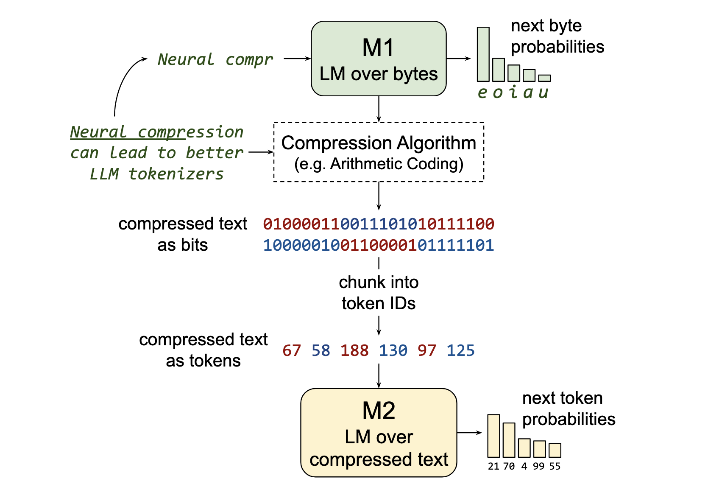
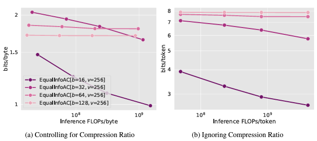
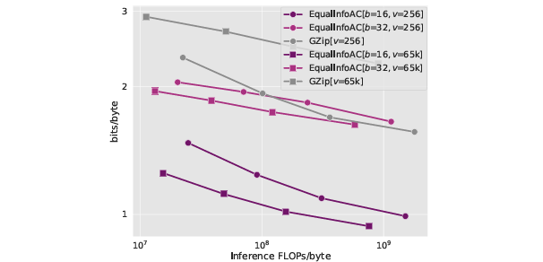

# Training LLMs over Neurally Compressed Text

## **TL;DR**

This paper addresses the problem of **training large language models (LLMs) using highly compressed text**, which offers several advantages: (i) faster training, (ii) improved serving efficiency, and (iii) easier handling of long text spans. However, strong compression can sometimes produce opaque outputs and difficult to use for learning.

To overcome this, **Equal-Info Windows** is proposed, a novel compression technique where text is segmented into blocks which are each compressed in to the same bit length. Experiments demonstrate that this method significantly outperforms *byte-level baselines* in both (i) perplexity and (ii) inference speed. Although the perplexity is worse than that of *subword tokenizers*, the method benefits from shorter sequence lengths, leading to reduced latency. Additionally, the paper provides an analysis of properties that contribute to learnability.

## Introduction

### Large Language Models (LLMs) and compression

LLMs are mostly trained over subword tokens, whereby the tokens are produced by tokenizers are *compressors* that typically achive ~4 compression. The advantages of using compressed text can be analyzed as the follwoing.

1. **Efficiency**
LLMs can process more text for the same computational cost, *effectively* increasing the amount of data seen during training and improving performance. This efficiency also reduces serving costs and inference latency by requiring fewer sequential autoregressive steps.
2. **Longer context**
LLMs can model longer contextual dependencies by reducing the sequence length, enabling transformers to handle longer contexts efficiently. This extended context is crucial for applications like document retrieval and answering coding questions with provided documentation.
3. **Distribution of Compute**
Information is spread more uniformly across the sequence, meaning each token represents an equal amount of information. This ensures the model allocates more compute to complex text spans, similar to "Adaptive Computation Time" but with dense, identical operations applied at each position.

### Motivation
Among many compression methods, [Arithmetic coding (AC)](#ac) has been known to reach near-optimal compression rate for a particular model. Motivated by this, the authors suggest the following compresion method.

1. A Small language model “M1” is trained over raw byte sequences
2. A frozen "M1" is used to compress pretraining corpus text by applying a standard compression algorithm, like AC.
4. The compressed bitstream is chunked into tokens, which are used to train a second language model “M2”, that directly reads and writes neural-compressed text.

### Challenges of LLMs over compressed text

1. **Learnability**
Strong compression can make the bitstream appear random and difficult to interpret. If M1 compresses too strongly, the bitstream may become too noisy for M2 to detect any meaningful signal. Therefore, M2 must accurately simulate M1's behavior and understand the compression process, which is complex and requires high-precision numerical state management. Also, M2 needs to learn the compression procedure itself.
2. **Numerical stability**
Compression methods can be sensitive to the precise model probabilities used. To achieve lossless compression, it is critical that the probabilities from M1 match exactly during both compression and decompression. However, ensuring this match is difficult in practice due to numerical noise in LLM inference, especially when running on parallel hardware.
3. **Multi-model inference**
For inference, multiple models simultaneously need to run and stored. Assuming M1 is relatively small, this additional overhead may not be a significant drawback compared to a standard tokenizer, which is also a separate model required for tokenizing text input and detokenizing LLM outputs.

## Method

Briefly, the training process can be summarized as the following steps.

1. ### Training data
All training data used is English web text from [C4 dataset](#c4). 128 documents are concatenated to generate a long sequence of text. This results an average length 277,760 bytes (128 documents), whic are split into individual examples and shuffled using the deterministic dataset functionality from [SeqIO](#seqio).

2. ### Training M1
Authors use a decoder-only Transformer model, where the final validation performance of the M1 model is 1.457 bits/byte. Similar to how tokenizers are trained, M1 and M2 are both trained on the C4 training data, but the final validation data used to evaluate M2 is unseen during M1 training.

3. ### Compression
Now, modeling compressed text can  be difficult because of language modeling model not able to track the state variables used in Arithmetic Coding.

To weaken the coding component of AC compression, the authors rest the AC encoder once it has output a set number of bits, creating windows of fixed size where each window is an independently AC-compressed sequence.

For example in the figure above, text is encoded into a series of N-bit windows. To determine each successive window, the remaining text is encoded byte-by-byte via Arithmetic Coding until no more bytes can be added without exceeding the target bit threshold, here 16 bits. Both M1 and the AC algorithm are reset at each step, so no information persists across windows.

4. ### Tokenization of compressed text

Training M2 directly over the bits from the compression method would be not ideal. Therefore, the bitstreams are converted into tokens, using a vocbulary size of $2^N$, i.e., grouping every $N$ bits to a token.

Another critical point to consider it the token compression ratio $L_{iT}/L_{oT}$, the ratio between the input and output token sequence lengths. This metric measures the weakening of Arithmetic coding. Note that the meaning of “token” can differ between the input and output sequences.

5. ### Training M2

Finally, the M2 model is trained for 200,000 steps with a batch size of 256 and a sequence length of 512, cumulatively training on 26.2 billion tokens. Models are trained at four sizes with 25M, 113M, 403M, and 2B parameters, excluding embedding parameters.

## Experiments

### Baselines
The M2 model is compared with two standard tokenization methods.
- **Bytes**
    - Train directly over UTF-8 bytes
    - Byte tokenizer from [ByT5](#byte)
    - Models sees 26.2 billion bytes total
- **SetencePiece**
    - Train on tokenized text
    - SentencePiece vocabulary of 32,000 tokens from [T5](#t5). 
    - Models see 112 billion bytes total

### Evaluation metrics

One major point is that models cannot be directly compared on “per-token” metrics such as negative log likelihood loss. Rather, following previous works, perplexity in terms of “bits-per-byte”, $[bits/byte] = (L_{oT} /L_{iT} ) \ell / ln(2)$ is used. Models are also compared on how much computation (FLOPs) are required to perform inference over a given length of raw text (bytes). When validating the models, C4 validation set is used. Models are run over 20 batches or ~2.6 million tokens. 

## Results & analysis

Obviously, simply training over nerual-compressed fails in terms of both bits/byte and inference FLOPs. Moreover, SentencePiece shows quite a impressive performance among the baselines.

### Equal-Info Windows make Arithmetic Coding(AC) learnable
EqualInfoAC[b=16, v=256] outperforms byte-level baselines, improving bits/byte performance and reducing FLOPs/byte due to shorter sequence lengths. EqualInfoAC[b=16, v=65k] models achieve competitive bits/byte performance and require fewer autoregressive steps than SentencePiece models, which can reduce generation latency. Despite SentencePiece's slight edge in bits/byte when FLOPs/byte are constant, EqualInfoAC's shorter sequences offer a significant advantage in latency-sensitive applications.

### Window size

Analyzing bits-per-token reveals a discernible pattern: longer window lengths pose greater challenges to learning, resembling the complexity of running Arithmetic Coding over the entire sequence. Shorter window sizes(16-bit windows) yield the best performance in terms of bits/byte. However, longer window sizes(128-bit windows) exhibit better compression rates despite limited learning by the models beyond a uniform distribution.

### Size of M2 vocabulary

Using a larger 16-bit vocabulary (v=65k) for tokenizing compressed text leads to a doubling in token compression rate, evident from the leftward shift of each curve depicted in the figure below.

## Conclusion

To sum up, the paper can be summarized as the following.

- The naive approach does not work, requiring a realtively simple modiciation.
- Compression Equal Info Windows results beter performance than byte-level models in terms of perplexity and inference cost, and close to the performance of SentencePiece tokenization
- Worse perplexity than subword tokenizers for models trained with the same parameter count, but offers benefit of shorter sequence lengths.

### Discussion

Though the Equal Info Windows shows quite impressive performance compared to byte-level models, worse preplexity compared to subword tokenizers is critical. Since the proposed methods contains the compression of bytes to tokens, this limitations be more highlighted.

### Future reserach direction

- Variational length compression
Currently, nearly the same length of bits are compressed into tokens. If compresingvariable length of bits to tokens, i.e., dictionary of variable lengths is possible would be a interseting research.
- Hierarhical compression
Bits are compress into tokens, and tokens are generated by the M2 model. The concept of using compression multiple times could be extended more, compressing list of tokens into another set of tokens. In other words, a hierarhical compression would also be a interesting research.

## Reference
1.  I. H. Witten, R. M. Neal, and J. G. Cleary. Arithmetic Coding for Data Compression. Communications of The Acm, 30(6):520–540, June 1987
2.  C. Raffel, N. Shazeer, A. Roberts, K. Lee, S. Narang, M. Matena, Y. Zhou, W. Li, and P. J. Liu. Exploring the Limits of Transfer Learning with a Unified Text-to-Text Transformer. Journal of Machine Learning Research (JMLR 2020), 21(140):1–67, 2020.
3.  A. Roberts, H. W. Chung, G. Mishra, A. Levskaya, J. Bradbury, D. Andor, S. Narang, B. Lester, C. Gaffney, A. Mohiuddin, C. Hawthorne, A. Lewkowycz, A. Salcianu, M. van Zee, J. Austin, S. Goodman, L. B. Soares, H. Hu, S. Tsvyashchenko, A. Chowdhery, J. Bastings, J. Bulian, X. Garcia, J. Ni, A. Chen, K. Kenealy, K. Han, M. Casbon, J. H. Clark, S. Lee, D. Garrette, J. Lee-Thorp, C. Raffel, N. Shazeer, M. Ritter, M. Bosma, A. Passos, J. Maitin-Shepard, N. Fiedel, M. Omernick, B. Saeta, R. Sepassi, A. Spiridonov, J. Newlan, and A. Gesmundo. Scaling Up Models and Data with t5x and seqio. Journal of Machine Learning Research, 24(377):1–8, 2023.
4.  L. Xue, A. Barua, N. Constant, R. Al-Rfou, S. Narang, M. Kale, A. Roberts, and C. Raffel. ByT5: Towards a Token-Free Future with Pre-trained Byte-to-Byte Models. Transactions of the Association for Computational Linguistics, 10:291–306, 2022.
5.  C. Raffel, N. Shazeer, A. Roberts, K. Lee, S. Narang, M. Matena, Y. Zhou, W. Li, and P. J. Liu. Exploring the Limits of Transfer Learning with a Unified Text-to-Text Transformer. Journal of Machine Learning Research (JMLR 2020), 21(140):1–67, 2020.
