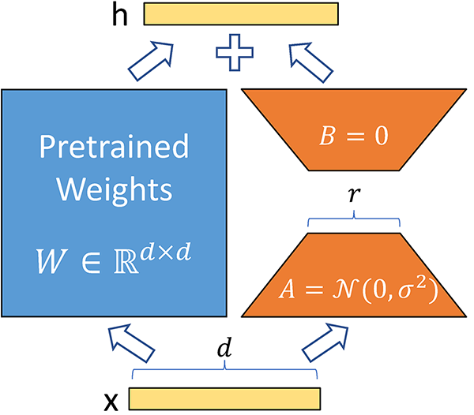
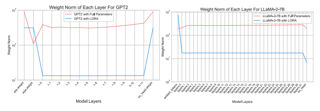
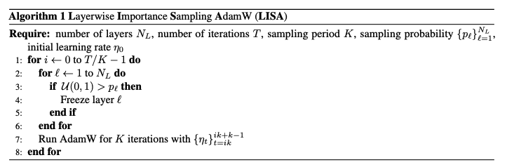
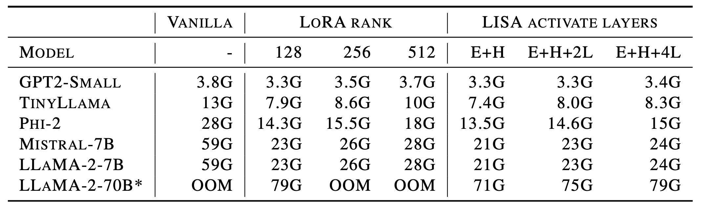
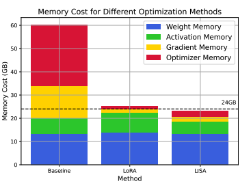
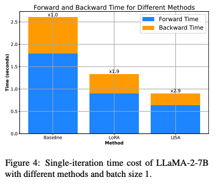
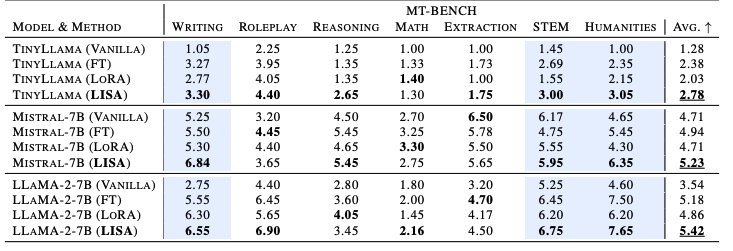
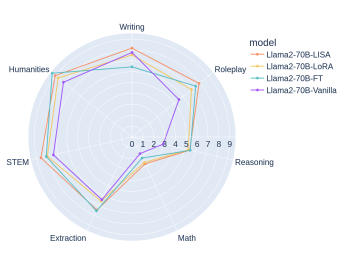
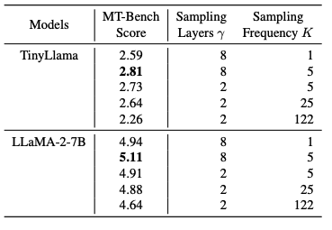

# LISA: Layerwise Importance Sampling for Memory-Efficient Large Language Model Fine-Tuning

Posted by: Sungbin Shin and Dongyeop Lee

The incredible versatility of large language models (LLM) on a wide variety of tasks has attracted many to leverage its power to perform specific tasks of interest (i.e., downstream task) via a process called fine-tuning, which consists of re-training the whole pretrained network on a new set of data.
However, its intensive computation and memory cost have led to the development of efficient techniques, particularly Parameter-Efficient Fine-Tuning (PEFT) approaches such as adapters, prompt weights, and, arguably one of the most widely used approaches, LoRA.

However, LoRA's performance has yet reach the level of full fine-tuning in all settings.
To overcome this shortcoming, the authors of [LISA](https://arxiv.org/abs/2403.17919) investigates into the training statistics of LoRA in each layer to discover that the distribution of layerwise weight norms of LoRA is uncommonly skewed, suggesting varying levels of importance of each layer.

This naturally brings forth to their **L**ayerwise **I**mportance **S**ampled **A**dam (**LISA**), which suggests selectively updating only the essential layers of the LLM sampled based on their importance and leaving others untouched.
This allows for the performance of traditional full-parameter fine-tuning with the parameter count of LoRA, indicating a large potential of LISA as a promising alternative to LoRA.

## Background

### Parameter-Efficient Fine-Tuning
Parameter-efficient fine-tuning (PEFT) methods adapt pre-trained models by fine-tuning only a subset of their parameters. These methods fall into three categories:

- Prompt Learning Methods: Focus on optimizing the input token or embedding while keeping the model parameters frozen. This approach generally has the lowest training cost.

- Adapter Methods: Introduce an auxiliary module with fewer parameters than the original model. Only the adapter module is updated during training.

- Selective Methods: These methods, closely related to LISA (Layerwise Importance Sampled AdamW), focus on fine-tuning a fraction of the model's parameters without adding extra modules. They include techniques like AutoFreeze, FreezeOut, and SmartFRZ, which improve training efficiency by selectively freezing layers based on importance, but these strategies are often complex and not widely adopted for large language models due to compatibility issues with modern memory reduction techniques.

### Low-Rank Adaptation (LoRA)

 

Low-Rank Adaptation (LoRA) is a technique commonly used for training large language models (LLMs) efficiently.
It reduces the number of trainable parameters by employing low-rank matrices, which significantly lessens computational and memory costs.
This method is particularly compatible with models featuring linear layers, allowing seamless integration without altering the model architecture.
LoRA can also be combined with other techniques like quantization and Mixture of Experts to further enhance performance and efficiency.

### Large-scale Optimization Algorithms

Efforts to optimize large language models (LLMs) focus on improving efficiency through various methods. Layerwise optimization, pioneered by Hinton and furthered by Bengio, has shown benefits in sequential layer pre-training. Techniques like LARS and LAMB improve generalization in large batch settings. Common optimization methods include Adam and AdamW. Recent approaches like MeZO and Sophia aim to reduce training costs and speed up processes but face challenges such as complexity and performance drops. GaLore attempts memory-efficient training via low-rank gradient projection. Despite these advances, LoRA-variant methods combined with AdamW remain dominant for fine-tuning large LLMs, though there's room for improvement.

## Method

### Motivation: training pattern of LoRA

To take a closer look at the effectiveness of LoRA, we measure the weight norm over different layers during fine-tuning.
Specifically, the value for  \ell -th layer is calculated as the mean over  T  iterations, i.e.,

  w^{(\ell)} \triangleq \texttt{mean-weight-norm}(\ell) = \frac{1}{T} \sum_{t=1}^{T} \|\theta^{(\ell)}_t\|_2,

where  \theta^{(\ell)}_t  is the parameter of  \ell -th layer at  t -th iteration during fine-tuning.

 

The results of the weight norm over different layers for GPT2 and LLaMA-2-7B models are presented above.
Here, the red and blue lines each correspond to the results of full fine-tuning and LoRA fine-tuning.
We observe the following intriguing phenomenons.

* For LoRA fine-tuning, weight norm has a skewed distribution; the values are significantly large for embedding layers and the final LM head whereas those for intermediate layers are much smaller.
* For full fine-tuning, the results are very different from LoRA; the values are more uniformly distributed.

Overall, the results imply that *LoRA treats layerwise importance in a very different way compared to full fine-tuning*.

### Layerwise Importance Sampled AdamW (LISA)

LISA aims to follow the training pattern of LoRA while avoiding its limitation of limited expressiveness due to low-rank nature.
Specifically, LISA borrows the idea from importance sampling and only updates a subset of layers at each iteration to simulate the training pattern of LoRA.
Since the weight norm of LoRA is significantly larger for the first and last layers compared to the intermediate ones, the sampling probability for each layer is determined as   \{p_\ell\}_{\ell=1}^{N_L} = \{1.0, \gamma/N_L, \gamma/N_L, \dots, \gamma/N_L, 1.0\}  , where  N_L  is the total number of layers and  \gamma  is the hyperparameter to control the number of layers to update at each iteration.
In other words, the first and last layers are always updated while each intermediate layer is updated with probability  \gamma/N_L .

 

The algorithm pseudocode is presented above.
For each round, it samples the layers to update and fine-tune the models with AdamW for  K  iterations.

## Experiments

### Efficiency

Since LISA only updates a subset of parameters at each iteration, it is expected to consume less memory compared to full fine-tuning.
We precisely measure the memory cost for different versions of LISA compared to full fine-tuning and LoRA.

 

The above table presents the peak GPU memory consumption for full fine-tuning, LoRA, and LISA.
Here, LoRA is experimented with different ranks and LISA is experimented with different versions of E+H (updating embedding and head layer), E+H+2L (updating E, H, and two intermediate layers), and E+H+4L (updating E, H, and four intermediate layers).
As we can see, LISA consumes much less memory compared to full fine-tuning and even less memory than LoRA; for LLaMA-2-70B model, LISA with E+H+2L requires 75B memory while LoRA with rank 128 requires 79GB memory.

 

More detailed analysis regarding the memory consumption is as above.
In particular, LISA consumes much less activation memory compared to LoRA as it does not require additional parameters to update unlike LoRA which introduces a new set of parameters.

 

Also, LISA can even accelerate the training speed; as seen in the above figure, LISA demonstrates near 2.9 times and 1.5 times speedups when compared to full fine-tuning and LoRA respectively.
Overall, LISA is more efficient than full fine-tuning and LoRA in terms of both memory and training time.

### Performance

In the previous experiments, we have observed that LISA significantly reduces the memory consumption and training time compared to full fine-tuning and LoRA.
Does LISA achieve efficiency without significant performance degradation compared to full fine-tuning?
Surprisingly, we find that LISA actually demonstrates better results than full fine-tuning.

 

First, we measure the performance for moderate-size language models having several billions of parameters.
As you can observe in the above table, LISA outperforms LoRA and even full fine-tuning (FT) by a large margin.

 

To further investigate the performance of LISA on large-scale models, we additionally test the method on LLaMA-2-70B having 70B parameters.
As shown in the above table, LISA outperforms LoRA for all tasks and even surpasses full fine-tuning on most tasks.

### Ablation study on hyperparameter

LISA has two hyperparameters:  \gamma  for determining the number of layers to update at each iteration, and  K  for determining how many iterations to perform with the sampled layers (i.e., sampling frequency).

 

The effects of two hyperparameters are presented in the above table.
First, it is observed that larger  \gamma  lead to increased performance, which is quite expected since more number of layers are updated at each iteration.
However, this also leads to the increased memory consumption, i.e., there exists a trade-off between performance and efficiency.
Second, larger  K  leads to increased performance by more frequently changing the layers to update.
However, too larger value can lead to inferior performance (see the result when  K =122 ).

## Discussion and future work

Overall, LISA proposes a simple idea of selectively updating only the important layers, which presents remarkable performance with reduced memory cost.
However, the comparison with other PEFT method is only limited to LoRA, making it hard to identify how it performs against alternative strategies such as prompt tuning and prefix tuning.

Nonetheless, we believe this paper can have some promising extensions.
Especially, the concept of layer-wise importance might be extended to determining the rank of LoRA in a layer-wise manner to conserve richer representation for important layers and save computation for less important ones for either performance improvements or improved efficiency.
Also recently, fine-tuning language models based on zeroth-order optimization ([MeZO](https://arxiv.org/abs/2305.17333)) have shown comparable performance to backpropgation-based methods with significantly reduced memory cost. It would be interesting to see if LISA can be integrated with zeroth-order methods to further reduce the memory cost without much performance degradation.
