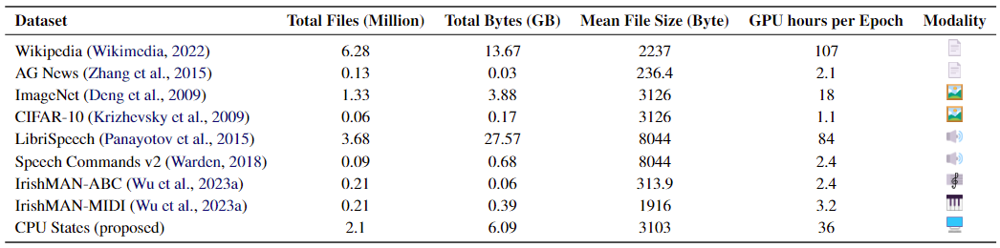
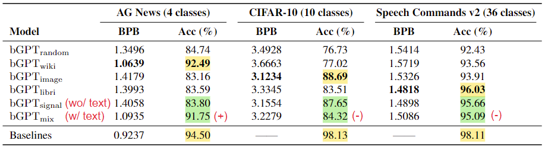

# Beyond Language Models: Byte Models are Digital World Simulators

*Authors: Shangda Wu, Xu Tan, Zili Wang, Rui Wang, Xiaobing Li, Maosong Sun*  
*Links: [Paper](https://arxiv.org/abs/2402.19155), [GitHub](https://github.com/sanderwood/bgpt), [Hugging Face](https://huggingface.co/sander-wood/bgpt), [Official Project Page](https://byte-gpt.github.io/)*

*Posted by Dohun Kim and Yeongwoo Kim*

## Introduction

Byte models take traditional language models to the byte level, treating all digital data and operations as fundamentally byte-based. These models process data from different modalities (such as text, images, and audio) uniformly as bytes, making them versatile in a wide digital environment. However, recent research on byte models has been limited, primarily focusing on narrow tasks and overlooking their broader potential in simulating the digital world.

  
*[Figure 1](https://byte-gpt.github.io/): The bGPT framework simulates digital systems using native binary data. It integrates diverse data types into a single model by treating everything as a byte sequence.*

To address this issues, the authors propose bGPT, which operates at the byte level and efficiently processes byte sequences. Through comprehensive evaluations across various modalities, bGPT demonstrates performance comparable to specialized models. Moreover, bGPT opens up new possibilities for simulating algorithms and hardware operations. By learning to predict the next byte, bGPT provides a deeper understanding of the intricate patterns in the digital world.

The main contributions of this paper are as follows:

- **bGPT**, a model with *next-byte prediction* is presented to simulate digital systems
- **Hierarchical Transformer architecture** is adapted to handle byte sequences efficiently.
- **In-depth analysis** of bGPT's performance on text, audio, and image data is provided.
- **Novel benchmarks** are introduced to show bGPT's capabilities for digital world simulation.

## bGPT Framework

### Model Architecture

Learning patterns in digital systems at the byte level offers a unified approach for integrating various data types. However, the high granularity of bytes leads to long sequences, which significantly increase computational costs due to the quadratic scaling of self-attention. This limits the efficiency and scalability of processing binary data.

  

*[Figure 2](https://byte-gpt.github.io/): The hierachical Transformer architecture of bGPT. It segments byte sequences into patches, to balance the need for long sequences and computational efficiency.*

To address this issue, the authors adapted a hierarchical structure for bGPT, enabling efficient handling of long byte sequences. This structure segments a sequence of byte B of length T into a sequence of patches \mathcal{P}, where each patch contains exactly S bytes, i.e., \mathcal{P} includes N = \left\lceil \frac{T}{S} \right\rceil patches. If T \mod S \neq 0, the last patch is padded with `<eop>` (end-of-patch) token.

#### Components of bGPT

- **Byte encoding**: Each byte is one-hot encoded into a 257-dimensional vector, including all possible byte values and `<eop>` token. Each patch is viewed as a matrix of size S \times 257.
- **Linear Projection Layer** maps the flattened patch into a dense vector of hidden size H, enabling more efficient processing of byte sequence.
- **Patch-Level Decoder** autoregressively predicts the features of the next patch, thereby learning the structural patterns of the entire dataset.
- **Byte-Level Decoder** takes the predicted patch features and autoregressively reconstruct the bytes within each patch. This process is repeated for all patches to generate the output byte sequence.

### Training Objectives

#### Pre-training: Generative Modeling

bGPT is pre-trained using a generative modeling approach, i.e., next-byte prediction. For a byte sequence B=\{b_1, b_2, \ldots, b_T\}, the model predicts the next byte b_{i+1} at each position. The loss function is the negative log likelihood of the next byte at each step, encouraging the model to maximize the likelihood of the actual occurrence of the next byte.


  \mathcal{L}_{\text{GEN}}(\theta) = - \sum_{i=1}^{T-1} \log p(b_{i+1} \mid b_1, b_2, \ldots, b_i; \theta)


#### Fine-tuning: Classification

bGPT is further fine-tuned for classification tasks by adding a classification head on top of the byte-level decoder. The model takes a byte sequence B as input and predicts the category y to which that sequence belongs. The loss function used is the cross-entropy loss, ensuring that the model accurately outputs the prediction probabilities for each category.


  \mathcal{L}_{\text{CLF}}(\theta) = - \sum_{k=1}^{K} y_k \log p(y_k \mid B; \theta)


## Applications

  
*[Table 1](https://arxiv.org/abs/2402.19155): Overview of datasets for bGPT evaluation, with computational costs benchmarked in NVIDIA V100 GPU hours.*

### Digital Media Processing

Having proficiency in processing diverse forms of digital media, including text, audio, and images, is a essential for human communication and interaction. bGPT is trained for generative modeling and classification tasks on text, images and speech dataset, demonstrating its ability to handle different modalities. The standardization for audio and image data was done as follows:

| Modality | Format      | Specifications |
|----------|-------------|----------------|
| Audio    | WAV         | 8000 Hz sampling rate, mono channel, 8-bit depth, 1 second length |
| Image    | BMP         | 32x32 resolution, RGB color, 24-bit depth |

### Algorithm and Hardware Simulation

Furthermore, to evaluate the model's ability to simulate algorithms and hardware operations, bGPT is trained on two underexplored tasks: data conversion and CPU state modeling. These tasks are crucial for understanding and predicting the behavior of digital systems.

- **Data Conversion**: bGPT learns to convert music data from ABC notation to MIDI format and vice versa. This task involves understanding the structure of music data and the conversion process between different formats.

- **CPU State Modeling**: bGPT predicts the state of a CPU after executing a sequence of machine instructions. This task requires understanding the internal operations of CPUs and predicting their states based on the given instructions.

## Experiments

### Performance Metrics

The performance of bGPT is evaluated using the following metrics:

- **Bits Per Byte (BPB)**: The average number of bits required to encode each byte in the output sequence. Lower BPB values indicate better performance.
- **Accuracy**: The percentage of correctly classified samples in the classification task. Higher accuracy values indicate better performance.

### Digital Media Processing

**Experiment Overview**
To assess the flexibility and versatility of the bGPT model, experiments with various types of digital media data were conducted. This involved handling a wide range of file types including text, audio, and image data. Also, to evaluate the model's generalization capabilities, various settings of mixed modalities and transfer learning were explored.

<!-- with the aim to measure the model's ability to process these types and to see how well bGPT generalizes compared to specialized models. The experiment included both generative modeling and classification tasks. -->

<!-- **Experimental Data**
The datasets used in the experiment included:

- **Text**: Wikipedia data and AG news dataset.
- **Audio**: LibriSpeech and Speech Commands v2 dataset.
- **Images**: ImageNet and CIFAR-10 dataset.

These datasets are ideal resources for evaluating the diverse media processing capabilities of bGPT.

**Experimental Setup** 
The bGPT model was trained under various settings:

- **bGPTimage**: Trained exclusively with image data (ImageNet).
- **bGPTlibri**: Trained exclusively with text data (Wikipedia).
- **bGPTmix**: Trained with a mix of all the above datasets.

Each model was fine-tuned for specific types of classification and generative tasks post-pretraining, providing a direct comparison of each model's performance. -->

#### Experimental Setup

| Model      | Modality | Pre-training dataset |
| ---------- | -------- | -------------------- |
| bGPTrandom | (None)   | (None, randomly initialized) |
| bGPTwiki   | Text     | Wikipedia            |
| bGPTimage  | Image    | ImageNet             |
| bGPTlibri  | Speech   | LibriSpeech          |
| bGPTsignal | Image+Speech | ImageNet+LibriSpeech |
| bGPTmix    | Text+Image+Speech | Wikipedia+ImageNet+LibriSpeech |

#### Results and Analysis

  
*[Table 2](https://arxiv.org/abs/2402.19155): Performance comparison of bGPT models pre-trained on different datasets and baseline models in their respective modalities: GPT2-small on text, ViT-B/16 on images, and AST on speech.*

#### Performance on downstream tasks (yellow)

- **Text/speech**: *competitive* performance compared to baseline models
- **Image**: Large discrepancy compared to baseline models.

 The sequential nature of byte-level processing made it difficult to capture spatial information in images, which is crucial for image tasks.

#### Mixed modality pre-training

- **Trade-off** between versatility and performance
- It dilutes the depth of domain-specific understanding in each modality

#### Cross-modal fine-tuning

- **Negative transfer** observed in transitioning between text and other modalities.
- Since text is *human-created*, byte-level patterns differ significantly from others.

#### Cross-model knowledge transfer efficacy

  

- **Downstream task**: Classification on *spectrogram images* with *speech content*
- **Result**: Accuracy - bGPTlibri > bGPTimage
- **Interpretation**: Content alignment is more important than modality alignment

### Algorithm and Hardware Simulation

**Experiment Overview** 
One of the unique capabilities of the bGPT model is its ability to simulate the operations of algorithms and hardware. This experimental section assesses how bGPT handles complex data conversion processes and CPU state modeling tasks. These capabilities are particularly significant in the fields of cybersecurity, system diagnostics, and hardware optimization.
<!-- 
**Experiment Methods** 
bGPT's performance was evaluated in the following two key areas:

- **Data Conversion**: This experiment evaluates whether bGPT can learn the process of converting ABC music notation into MIDI format. The task tests how bGPT models complex algorithms and their ability to convert actual music files.
- **CPU State Modeling**: CPU state modeling assesses how bGPT predicts and updates the state of a CPU based on a given set of machine instructions. This is particularly useful for understanding and predicting hardware operations. -->

#### Results and Analysis

  
   

- **Data Conversion Performance**: bGPT performed the conversion between MIDI and ABC notation with high accuracy. Notably, it also showed high accuracy in converting MIDI back to ABC notation, indicating that bGPT successfully learned the inherent structures and patterns of the data.
- **CPU State Modeling Performance**: bGPT accurately predicted the resulting state of CPUs from an initial state across a variety of CPU instructions. It achieved over 99% accuracy even with complex instruction sequences, demonstrating bGPT's detailed understanding of the internal workings of hardware.

***

## Conclusion and Future Work

bGPT has proven to be a powerful model capable of effectively processing various types of digital media data. Particularly, this model can be flexibly applied to different types of data and has demonstrated performance that can compete with models pretrained on specific datasets. These results show that bGPT can be extremely useful in solving a wide range of real-world problems.

Moreover, bGPT has proven its ability to go beyond simply processing data, successfully modeling and simulating the operations of complex algorithms and hardware. This capability will be particularly valuable in fields related to technical problem solving and new hardware design.

bGPT extends deep learning to binary data processing through byte prediction. Experiments have demonstrated bGPT's strong scalability in native binary data modeling.

Future research directions for byte models include:

- Reducing training costs to make byte model training more feasible.
- Expanding the model and dataset sizes to accommodate a wider range of native binary data and handle larger digital media files such as high-resolution images and videos.
- Improving performance in underexplored tasks involving native binary data across various application domains.

## References

[Beyond Language Models: Byte Models are Digital World Simulators (arXiv)](https://arxiv.org/abs/2402.19155)  
[Beyond Language Models: Byte Models are Digital World Simulators (Project Page)](https://byte-gpt.github.io/)  
