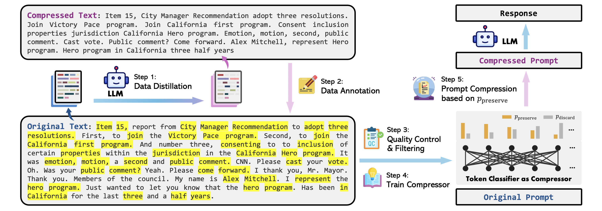
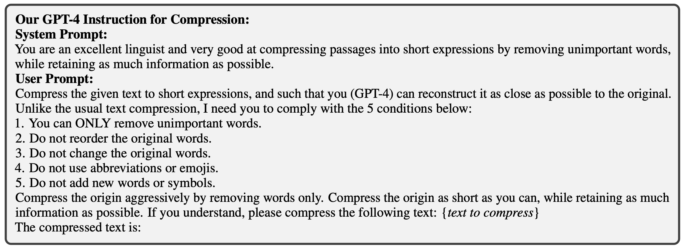
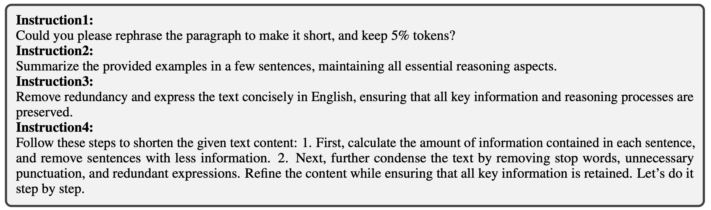
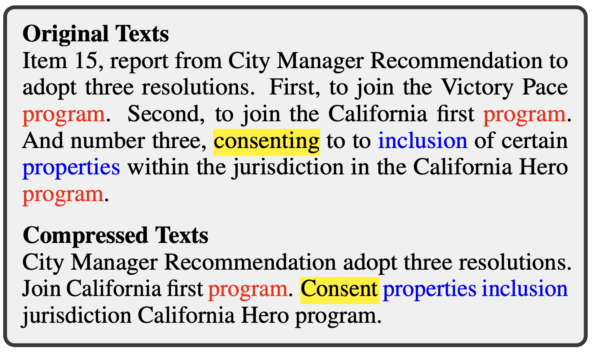
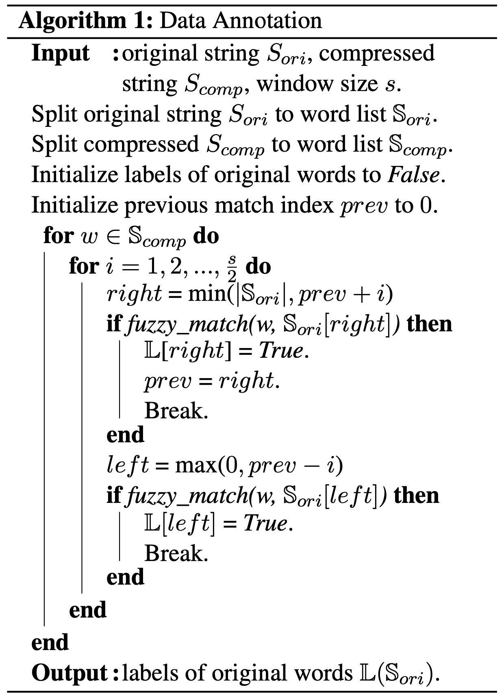
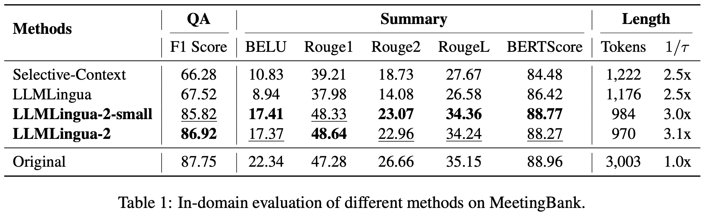
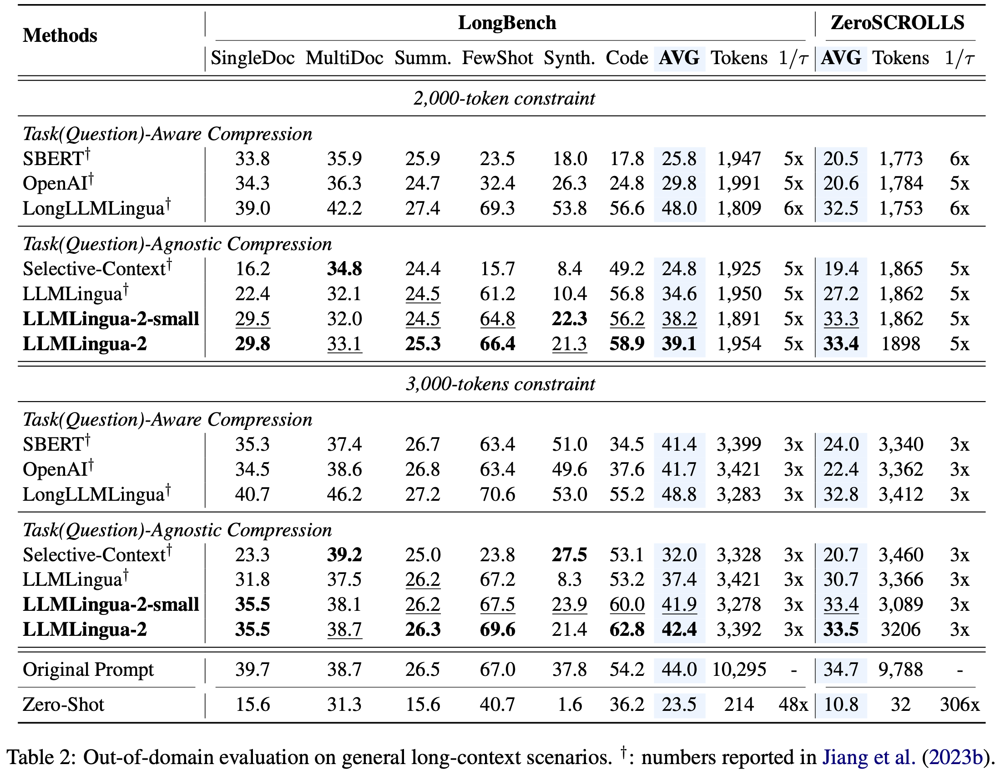
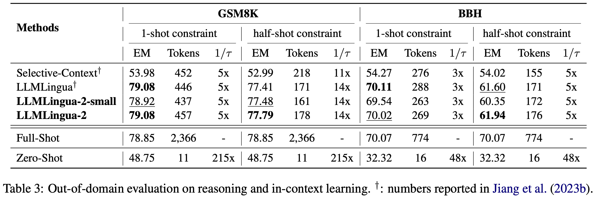
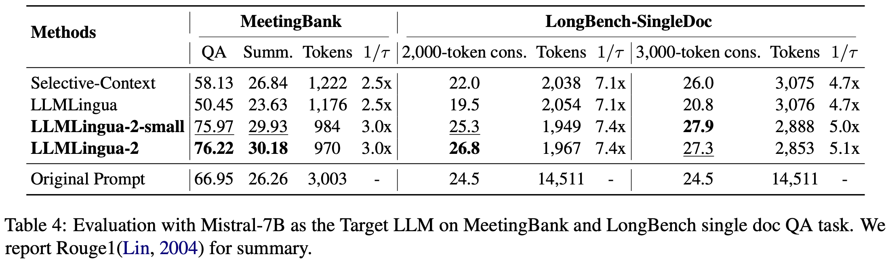

# LLMLingua-2: Data Distillation for Efficient and Faithful Task-Agnostic Prompt Compression

> [**LLMLingua-2: Data Distillation for Efficient and Faithful Task-Agnostic Prompt Compression**](https://arxiv.org/abs/2403.12968) \
> Zhuoshi Pan1, Qianhui Wu2, Huiqiang Jiang2, Menglin Xia2, Xufang Luo2, Jue Zhang2, Qingwei Lin2, Victor Rühle2, Yuqing Yang2, Chin-Yew Lin2,
H. Vicky Zhao1, Lili Qiu2, and Dongmei Zhang2 \
> 1Tsinghua University, 2Microsoft Corporation \
> This blog post is written by Seungjoo Shin, and Sua Choi

## Summary

This paper introduces a novel approach, *LLMLingua-2*, for task-agnostic prompt compression to enhance the **generalizability** and **efficiency** of LLMs. It highlights the limitations of existing methods that rely on information entropy and proposes a data distillation procedure to create a more effective compression algorithm. This approach ensures essential information is preserved, leading to significant performance improvements and reduced computational overhead.

## 1. Introduction

### What is Prompt Compression?

A straightforward solution to *shorten the original prompts without losing essential information*.

- **Task-aware Prompt Compression**
    
    - Prompt compression methods that aim to generate compressed prompts tailored to the specific task or query.

    &rarr; Lack of <u>efficiency</u> and <u>generalizability</u> due to the dependency on task-specific features.

- **Task-agnostic Prompt Compression**
    - Prompt compression methods for **better generalizability and efficiency** with the underlying assumption that *natural language contains **redundancy** [[1]](#reference) that may be useful for human understanding but might not be necessary for LLMs*.
    - Compress prompts by **removing tokens** [[2]](#reference) or **lexical units** [[3]](#reference) according to their information entropy obtained from a causal small language model (SLM), regardless of the downstream task or question information.

    &rarr; Typically adopt information entropy-based metrics which are <u>empirical</u>.

    &rarr; Only leverage <u>unidirectional</u> context, which may fail to capture all essential information needed for prompt compression within the context.

 ### Key Challenges

1. **Dataset Alignment**: How can we identify or build a suitable dataset to align the Small Language Model (SLM) towards effective prompt compression?

    &rarr; An extractive text compression dataset that retains essential information (Sec. [2](#2-dataset-construction)).
2. **Compression Algorithm Design**: How can we design a compression algorithm that effectively leverages the full bidirectional context for better performance?

    &rarr; Prompt compression as a binary token classification problem using Transformer encoder (Sec. [3](#3-compressor)).

## 2. Dataset Construction

### Data Distillation
Extracting knowledge from an LLM (GPT-4) to compress texts without <u>losing crucial information</u> or <u>introducing hallucinated content</u>.

Goal: To prompt GPT-4 to generate compressed texts from original texts that meet the following criteria: 

1. **Token reduction**: Compressed prompts should be short in length to reduce cost and speed up inference. 

2. **Informativeness**: Essential information should be retained. 

3. **Faithfulness**: Compressed prompts should remain faithful and avoid introducing hallucinated content to ensure accuracy when prompting LLMs in downstream tasks.

#### Instruction Design

- Remove the compression ratio restriction & Prompt to compress the origin text as short as possible

#### Chunk-Wise Compression

- Segment each long context into **multiple chunks**, each containing no more than 512 tokens and ending with a period.

#### Compared to Instructions of LLMLingua [[2]](#reference)

### Data Annotation
Assigning *binary* labels to each word (or token) in the original text to indicate whether it should be <u>preserved</u> or <u>discarded</u> after compression, leveraging the distilled knowledge from the LLM.

#### Challenges in Data Annotation

LLMLingua-2 addresses challenges of ambiguity, variation, and reordering as:

1.  **Ambiguity**: a word in the compressed texts may appear multiple times in the original content.

2.  **Variation**: GPT-4 may modify the original words in tense, plural form, etc. during compression.

3.  **Reordering**: The order of words may be changed after compression.

#### Overall Procedure of the Annotation Algorithm:

### Quality Control
Introducing metrics to filter low-quality samples, ensuring high-quality dataset construction.

#### Notations:
- \mathbb{S}_{comp} : the set of words in the compressed text.
- \mathbb{S}_{ori} : the set of words in the original text.
- | · |: the cardinality of a set.
- l(·) : the annotation function.
    - *e.g.*, l(w) = True signifies that word w \in \mathbb{S}_{ori} corresponds to a word in \mathbb{S}_{comp} .

#### Variation Rate (VR)

- A metric to evaluate the quality of the compressed texts generated from data distillation.

    **Variation Rate (VR)** is defined as:
    
    
        VR = \frac{1}{|\mathbb{S}_{comp}|} \displaystyle\sum_{w \in \mathbb{S}_{comp}} \mathbb{I}(w \notin \mathbb{S}_{ori}).
    
    
- LLMLingua-2 **excludes** the examples with the <u>top 5% highest variation rates</u>.

#### Alignment Gap (AG)

- A metric to evaluate the quality of the automatically annotated labels.

    **Alignment Gap (AG)** is defined as:
    
    
        AG = \frac  {1}{|\mathbb{S}_{ori}|} \displaystyle\sum_{w \in \mathbb{S}_{comp}} \mathbb{I}(w \in \mathbb{S}_{ori}) - \frac{1}{|\mathbb{S}_{ori}|} \displaystyle\sum_{w \in \mathbb{S}_{ori}} \mathbb{I}(l(w) = True).
    
    
- LLMLingua-2 **discards** examples of <u>the highest 10% alignment gap</u>.

## 3. Compressor

They formulate prompt compression as a **binary token classification problem** (*i.e.*, preserve or discard) to guarantee the faithfulness of the compressed prompt to the original content, and meantime ensure the low latency of the compression model itself.

### Token Classification Model

#### Architecture
They utilize a **Transformer encoder** [[10]](#reference) as the feature encoder f_\theta  and add a linear classification layer on top.
Given an original prompt consisting of N  words \boldsymbol{x} = \{x_i\}_{i=1}^{N} , this can be formulated as:


    \boldsymbol{h} = f_{\theta}(\boldsymbol{x}), \\
    p(x_i,\Theta) = \mathrm{softmax}(Wh_i +b),


where \boldsymbol{h}=\{h_i\}_{i=1}^{N}  denotes feature vectors for all words, p(x_i, \Theta) \in \mathbb{R}^2  denotes the probability distribution of labels \{\mathtt{preserve}, \mathtt{discard}\}  for the i -th word x_i , and \Theta = \{\theta, W, b\}  represent all the trainable parameters.

#### Training

Let \boldsymbol{y} = \{y_i\}_{i=1}^{N}  denote the corresponding labels for all words in \boldsymbol{x} , then they employ cross entropy loss to train the model. The loss function \mathcal{L}  *w.r.t.* \boldsymbol{x}  is:



    \mathcal{L}(\Theta) = \frac{1}{N} \displaystyle\sum_{i=1}^{N}\mathrm{CrossEntropy}(y_i, p(x_i, \Theta)).



### Compression Strategy

Compressing the original prompt \boldsymbol{x} = \{x_i\}_{i=1}^N  with a target compression ratio 1/\tau , where \tau  is defined as the quotient of the number of words in the compressed prompt and the number of words in the original prompt \boldsymbol{x} .

1. They derive the target number of tokens to be preserved in the compressed prompt \tilde {\boldsymbol{x}} : \tilde{N} = \tau N . 

2. Next, they use the token classification model to predict the probability p_i  of each word x_i  being labeled as \mathtt{preserve} . 

3. Finally, they retain the top \tilde{N}  words in the original prompt \boldsymbol{x}  with the highest p_i  and maintain their original order to form the compressed prompt \tilde{\boldsymbol{x}} .

## 4. Experiments
 
### Experimental Setup
- Dataset: MeetingBank [[4]](#reference)
- Evaluation:
  - In-domain: Summarization (MeetingBank [[4]](#reference)), QA (MeetingBank [[4]](#reference) QA)
  - Out-of-domain: Long-context scenarios (LongBench [[5]](#reference), Zero-SCROLLS [[6]](#reference)), Reasoning & in-context learning (GSM8K [[7]](#reference), Big Bench Hard (BBH) [[8]](#reference))
- Backbone: xlm-roberta-large (LLMLingua-2) [[9]](#reference), multilingual-BERT (LLMLingua-2-small) [[10]](#reference)
 
### Results on In-Domain Benchmark
Demonstrates significant performance gains on MeetingBank for both summarization and QA tasks.
 

 
### Results on Out-of-Domain Benchmarks
Shows robust generalization across various benchmarks, including LongBench, ZeroScrolls, GSM8K, and BBH.
 

 
### Mistral-7B as the Target LLM
Demonstrates good generalization ability across target LLMs.
 

 
 
## 5. Conclusion
The LLMLingua-2 model provides an efficient, task-agnostic solution for prompt compression, significantly reducing computational overhead while maintaining the integrity and usefulness of the compressed prompts.
 
## 6. Discussion
The compressed dataset was constructed only on the training samples from a single benchmark (MeetingBank [[4]](#reference)).
In this sense, one of the probable research directions would be generalizing the proposed compression approch in terms of scale or target domain (task).

## Reference

[1] Claude E Shannon. 1951. Prediction and entropy of printed english. Bell system technical journal, 30(1):50–64.

[2] Huiqiang Jiang, Qianhui Wu, Chin-Yew Lin, Yuqing Yang, and Lili Qiu. 2023a. [LLMLingua: Compressing prompts for accelerated inference of large language models](https://doi.org/10.18653/v1/2023.emnlp-main.825). In Proceedings of the 2023 Conference on Empirical Methods in Natural Language Processing, pages 13358–13376, Singapore. Association for Computational Linguistics.

[3] Yucheng Li, Bo Dong, Frank Guerin, and Chenghua Lin. 2023. [Compressing context to enhance inference efficiency of large language models](https://doi.org/10.18653/v1/2023.emnlp-main.391). In Proceedings of the 2023 Conference on Empirical Methods in Natural Language Processing, pages 6342–6353, Singapore. Association for Computational Linguistics.

[4] Yebowen Hu, Tim Ganter, Hanieh Deilamsalehy, Franck Dernoncourt, Hassan Foroosh, and Fei Liu. 2023. [Meetingbank: A benchmark dataset for meeting summarization](https://arxiv.org/abs/2305.17529). ArXiv preprint, abs/2305.17529.

[5] Yushi Bai, Xin Lv, Jiajie Zhang, Hongchang Lyu, Jiankai Tang, Zhidian Huang, Zhengxiao Du, Xiao Liu, Aohan Zeng, Lei Hou, et al. 2023. [Longbench: A bilingual, multitask benchmark for long context understanding](https://arxiv.org/abs/2308.14508). ArXiv preprint, abs/2308.14508.
 
[6] Uri Shaham, Maor Ivgi, Avia Efrat, Jonathan Berant, and Omer Levy. 2023. [Zeroscrolls: A zero-shot benchmark for long text understanding](https://arxiv.org/abs/2305.14196). ArXiv preprint, abs/2305.14196.
 
[7] Karl Cobbe, Vineet Kosaraju, Mohammad Bavarian, Mark Chen, Heewoo Jun, Lukasz Kaiser, Matthias Plappert, Jerry Tworek, Jacob Hilton, Reiichiro Nakano, et al. 2021. [Training verifiers to solve math word problems](https://arxiv.org/abs/2110.14168). ArXiv preprint, abs/2110.14168.
 
[8] BIG bench authors. 2023. [Beyond the imitation game: Quantifying and extrapolating the capabilities of language models](https://openreview.net/forum?id=uyTL5Bvosj). Transactions on Machine Learning Research.
 
[9] Alexis Conneau, Kartikay Khandelwal, Naman Goyal, Vishrav Chaudhary, Guillaume Wenzek, Francisco Guzmán, Edouard Grave, Myle Ott, Luke Zettlemoyer, and Veselin Stoyanov. 2020. [Unsupervised cross-lingual representation learning at scale](https://doi.org/10.18653/v1/2020.acl-main.747). In Proceedings of the 58th Annual Meeting of the Association for Computational Linguistics, pages 8440–8451, Online. Association for Computational Linguistics.
 
[10] Jacob Devlin, Ming-Wei Chang, Kenton Lee, and Kristina Toutanova. 2019. [BERT: Pre-training of deep bidirectional transformers for language understanding](https://doi.org/10.18653/v1/N19-1423). In Proceedings of the 2019 Conference of the North American Chapter of the Association for Computational Linguistics: Human Language Technologies, Volume 1 (Long and Short Papers), pages 4171–4186, Minneapolis, Minnesota. Association for Computational Linguistics.
